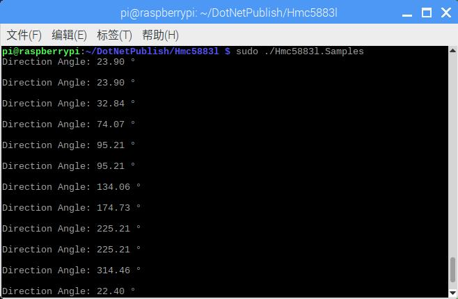

# HMC5883L - Samples

## Hardware Required
* HMC5883L
* Male/Female Jumper Wires

## Circuit


* SCL - SCL
* SDA - SDA
* VCC - 5V
* GND - GND

## Code
```C#
I2cConnectionSettings settings = new I2cConnectionSettings(1, Hmc5883l.DefaultI2cAddress);
I2cDevice device = I2cDevice.Create(settings);

using (Hmc5883l sensor = new Hmc5883l(device))
{
    while (true)
    {
        // read heading
        Console.WriteLine($"Heading: {sensor.Heading.ToString("0.00")} °");
        Console.WriteLine();

        // wait for a second
        Thread.Sleep(1000);
    }
}

```

## Result

