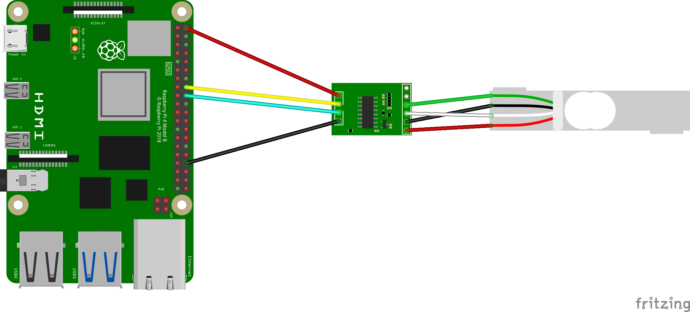

# HX711: Load Cell amplifier and 24-Bit ADC Module

## Summary

Device binding for the HX711 weight componet. This componet is necessary if you want to read the weight from a load cell, due to the analog signal and too weak emitted.
The Load Cell Amplifier and ADC Module is a small breakout board for the HX711 IC that allows you to easily read load cells to measure weight.
By connecting the module to your microcontroller you will be able to read the changes in the resistance of the load cell and with some calibration you’ll be able to get very accurate weight measurements.
This can be handy for creating your own industrial scale, process control, or simple presence detection.

## Documentation

1. [HX711 - Source 1](https://homotix_it.e-mind.it/upld/repository/File/hx711.pdf)
2. [HX711 - Source 2](https://html.alldatasheet.com/html-pdf/1132222/AVIA/HX711/457/1/HX711.html)
3. [Example for Arduino](https://www.moreware.org/wp/blog/2020/06/09/arduino-come-funziona-la-board-per-celle-di-carico-hx711/)

## Usage with calibration process

```csharp
int pinDout = 23;
int pinPdSck = 24;

using (var controller = new GpioController())
{
    using (var hx711 = new Hx711(pinDout, pinPdSck, gpioController: controller, shouldDispose: false))
    {
        hx711.PowerUp();
        Console.WriteLine("HX711 is on.");

        for (int i = 0; i < 3; i++)
        {
            Console.WriteLine("Known weight (in grams) currently on the scale:");
            var weightCalibration = int.Parse(Console.ReadLine() ?? "");
            hx711.SetCalibration(Mass.FromGrams(weightCalibration));
        }

        Console.WriteLine("Press ENTER to tare.");
        _ = Console.ReadLine();
        hx711.Tare();
        Console.WriteLine($"Tare set. Value: {hx711.TareValue}");

        Console.WriteLine("Press ENTER to start reading.");
        _ = Console.ReadLine();

        for (int i = 0; i < 25; i++)
        {
            var weight = hx711.GetWeight();
            Console.WriteLine($"Weight: {weight}");

            Thread.Sleep(2_000);
        }

        hx711.PowerDown();
        Console.WriteLine("HX711 is off.");

        Console.WriteLine("Press ENTER to close.");
        _ = Console.ReadLine();
    }
}
```

## Usage without calibration process

```csharp
int pinDout = 23;
int pinPdSck = 24;

using (var controller = new GpioController())
{
    using (var hx711 = new Hx711(pinDout, pinPdSck, gpioController: controller, shouldDispose: false))
    {
        hx711.PowerUp();
        Console.WriteLine("HX711 is on.");

        // 1 gram every 107.55 hx711 units
        hx711.SetConversionRatio(conversionRatio: 107.55);

        Console.WriteLine("Press ENTER to tare.");
        _ = Console.ReadLine();
        hx711.Tare();
        Console.WriteLine($"Tare set. Value: {hx711.TareValue}");

        Console.WriteLine("Press ENTER to start reading.");
        _ = Console.ReadLine();

        for (int i = 0; i < 25; i++)
        {
            var weight = hx711.GetWeight();
            Console.WriteLine($"Weight: {weight}");

            Thread.Sleep(2_000);
        }

        hx711.PowerDown();
        Console.WriteLine("HX711 is off.");

        Console.WriteLine("Press ENTER to close.");
        _ = Console.ReadLine();
    }
}
```

## Hardware Required

* Load cell
* HX711
* Male/Female Jumper Wires

## Circuit - Scheme



* VCC - 5V
* GND - GND
* Pin Dout - GPIO 23
* Pin PD_SCK - GPIO 24

The fritz diagram above depicts how you should wire your RPi in order to run a example program.

## Pinouts HX711

### Analog Side

| Name              | PCB description |
| ----------------- | --------------- |
| Sensor red wire   | E+              |
| Sensor black wire | E-              |
| Sensor white wire | A-              |
| Sensor green wire | A+              |

### Digital Side

| Name              | PCB description         |
| ----------------- | ----------------------- |
| GND               | Ground Power Connection |
| DT                | Data IO Connection      |
| SCK               | Serial Clock Input      |
| VCC               | Power Input             |

## Calibration

First of all HX711 need a calibration process because it can be connected to any load cell that has a different range and sensitivity.
To perform it, simply put a known weight on the load cell and start the calibration via `SetCalibration()`.
If you want a more precise calibration, you can do this several times with different weights.
If you don't want to carry out the calibration at every start, you can memorize the `ConversionRatio` which is valued after the calibration and set it using `SetConversionRatio` method.

## Accuracy

To maintain a higher level of accuracy, if multiple samples are used during calibration, the returned weight is unrounded.
Therefore it may happen that if a weight of 200 g is used in the calibration phase, if re-read at a later time it returns 199.9999998 g.

## Notes

Only connection in Channel A is support at the moment.
