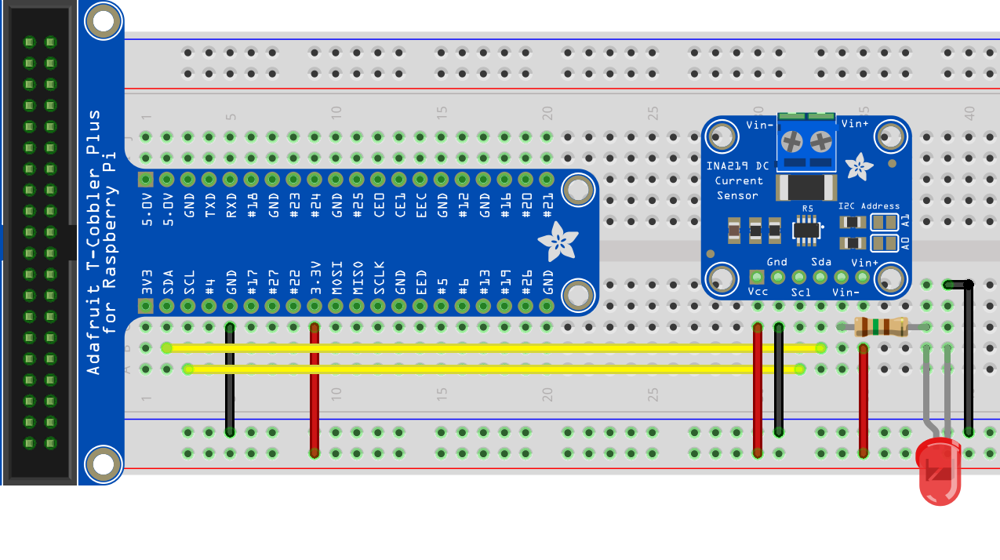

# INA219 Sample

This sample connects to a Raspberry Pi via the first I2c device. Please ensure that I2c is enabled by using raspi-config or add the following line to the /boot/Config.txt file

 `dtparam=i2c_arm=on`

## Measuring the voltage current and power of a light emitting diode.

This sample uses an Adafruit INA219 breakout board with a Raspberry Pi and monitors a LED wired into the 3.3 volts supply with a 150 ohm current limiting resistor. It prints the bus voltage, shunt voltage, current and power every second.

    const byte Adafruit_Ina219_I2cAddress = 0x40;
    const byte Adafruit_Ina219_I2cBus = 0x1;

    // create an Ina219 device on I2c bus 1 addressing channel 64
    using (Ina219 device = new Ina219(new I2cConnectionSettings(Adafruit_Ina219_I2cBus, Adafruit_Ina219_I2cAddress)))
    {
        // reset the device 
        device.Reset();

        // set the calibration to have a +/- 100mA range
        device.SetCalibration(Ina219.PgaSensitivity.PlusOrMinus40mv, 0.1F);
        while (true)
        {
            // write out the current values from the Ina219 device.
            System.Console.WriteLine($"Bus Voltage {device.GetBusVoltage()}V Shunt Voltage {device.GetShuntVoltage() * 1000}mV Current {device.GetCurrent() * 1000}mA Power {device.GetPower() * 1000}mW");
            System.Threading.Thread.Sleep(1000);
        }
    }
