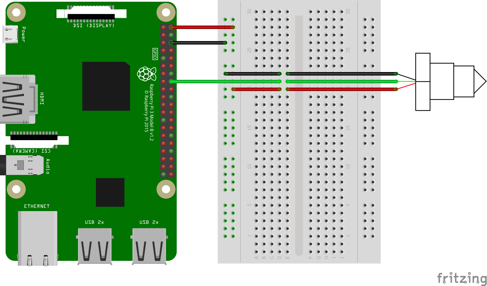

# Digital liquid level switch Samples

## LLC200D3SH Circuit

The following fritzing diagram illustrates one way to wire up the Optomax LLC200D3SH digital liquid level switch with a Raspberry Pi.



## Code

Define the LLC200D3SH sensor using the LiquidLevelSwitch class.

```C#
using (Llc200d3sh sensor = new Llc200d3sh(23))
{
    while (true)
    {
        // read liquid level switch
        Console.WriteLine($"Detected: {sensor.IsLiquidPresent()}");
        Console.WriteLine();

        Thread.Sleep(1000);
    }
}
```

## References

- LLC200D3SH sensor ([Datasheet](https://cdn-shop.adafruit.com/product-files/3397/3397_datasheet_actual.pdf))
