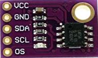

# LM75
The LM75 is a temperature sensor, Delta-Sigma analog-to-digital converter, and digital over-temperature detector with I2C interface.

## Sensor Image


## Usage
```C#
I2cConnectionSettings settings = new I2cConnectionSettings(1, Lm75.DefaultI2cAddress);
// get I2cDevice (in Linux)
UnixI2cDevice device = new UnixI2cDevice(settings);
// get I2cDevice (in Win10)
//Windows10I2cDevice device = new Windows10I2cDevice(settings);

using(Lm75 sensor=new Lm75(device))
{
    double temperature = sensor.Temperature;
}
```

## References
https://cdn.datasheetspdf.com/pdf-down/L/M/7/LM75_NationalSemiconductor.pdf
