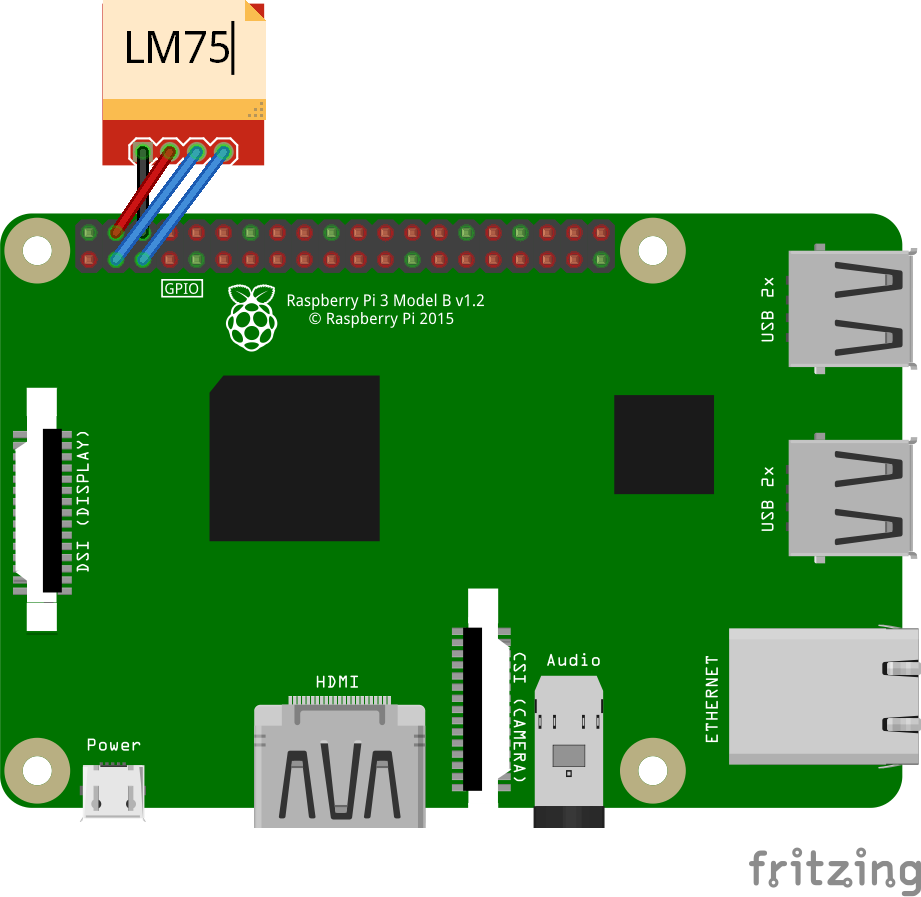

# LM75 - Digital Temperature Sensor

The LM75 is a temperature sensor, Delta-Sigma analog-to-digital converter, and digital over-temperature detector with I2C interface.

## Documentation

- LM75 [datasheet](https://www.analog.com/media/en/technical-documentation/data-sheets/LM75.pdf)


## Usage

```C#
I2cConnectionSettings settings = new I2cConnectionSettings(1, Lm75.DefaultI2cAddress);
I2cDevice device = I2cDevice.Create(settings);

using(Lm75 sensor = new Lm75(device))
{
    double temperature = sensor.Temperature.Celsius;
}
```

## LM75 Example

### Circuit



- SCL - SCL
- SDA - SDA
- VCC - 5V
- GND - GND

### Code

```C#
I2cConnectionSettings settings = new I2cConnectionSettings(1, Lm75.DefaultI2cAddress);
I2cDevice device = I2cDevice.Create(settings);

using(Lm75 sensor = new Lm75(device))
{
    while (true)
    {
        Console.WriteLine($"Temperature: {sensor.Temperature.Celsius} ℃");
        Console.WriteLine();

        Thread.Sleep(1000);
    }
}
```

### Result


