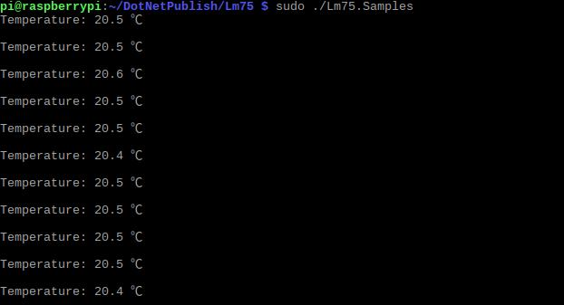

# Example of LM75

## Hardware Required
* LM75
* Male/Female Jumper Wires

## Circuit


* SCL - SCL
* SDA - SDA
* VCC - 5V
* GND - GND

## Code
```C#
I2cConnectionSettings settings = new I2cConnectionSettings(1, Lm75.DefaultI2cAddress);
UnixI2cDevice device = new UnixI2cDevice(settings);

using(Lm75 sensor=new Lm75(device))
{
    while (true)
    {
        Console.WriteLine($"Temperature: {sensor.Temperature} ℃");
        Console.WriteLine();

        Thread.Sleep(1000);
    }
}
```

## Result

