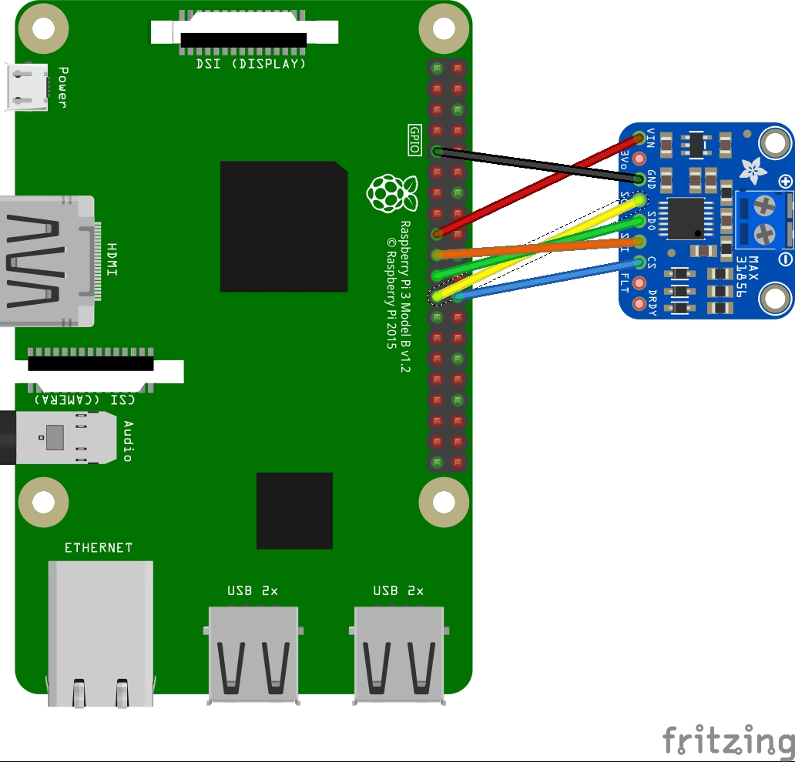

# MAX31856

## Summary
The MAX31856 device is a SPI interface cold-junction compensated thermocouple to digital converter.

## Sensor Image


## Usage
The MAX31856.samples file contains a sample usage of the device. Note that this reads two temperatures. One is a connected thermocouple reading called ```temp``` and the other is the temperature of the device itself called ```tempCJ``` which is used internally to increase the accuracy of the thermocouple but can also be read if you find a use for it.

Create a new ```SpiConnectionSettings``` Class if using a raspberry pi3 do not change these settings.

```csharp
SpiConnectionSettings settings = new(0, 0)
{
    ClockFrequency = MAX31856.SpiClockFrequency,
    Mode = MAX31856.SpiMode,
    DataFlow = 0
};
```

Create a new ```SpiDevice``` with the settings from above. Then create a new MAX31856 device with the ```SpiDevice``` as well as the correct ```ThermocoupleType``` (see note below)
```csharp
using SpiDevice device = SpiDevice.Create(settings);
using MAX31856 sensor = new(device, ThermocoupleType.K);
```

Now read the temperature from the device. Using the UnitsNet nuget you can convert from DegreesCelsius to DegreesFahrenheit or any other unit by changing ```.GetTemperature().DegreesFahrenheit``` to another unit of your choice.

```csharp
while (true)
{
    // read temperature
    var temp = sensor.GetTemperature().DegreesFahrenheit;
    temp = Math.Round(temp, 7); // round temp output to seven significant figures from resolution in Technical Documentation
    // read cold junction temperature of device
    var tempCJ = sensor.GetCJTemperature().DegreesFahrenheit;
    tempCJ = Math.Round(tempCJ, 2); // round temp output to two significant figures from resolution in Technical Documentation
    Console.WriteLine($"Temp: {temp} ColdJunctionTemp: {tempCJ} ");

    // wait for 2000ms
    Thread.Sleep(2000);
}
```

**Note:** _ThermocoupleType.K is configured for a K type thermocouple if you want to use a B,E,J,K,N,R,S, or T simply change the K to the thermocouple type of your choosing._

## References 

**MAX31856** [datasheet](https://datasheets.maximintegrated.com/en/ds/MAX31856.pdf)