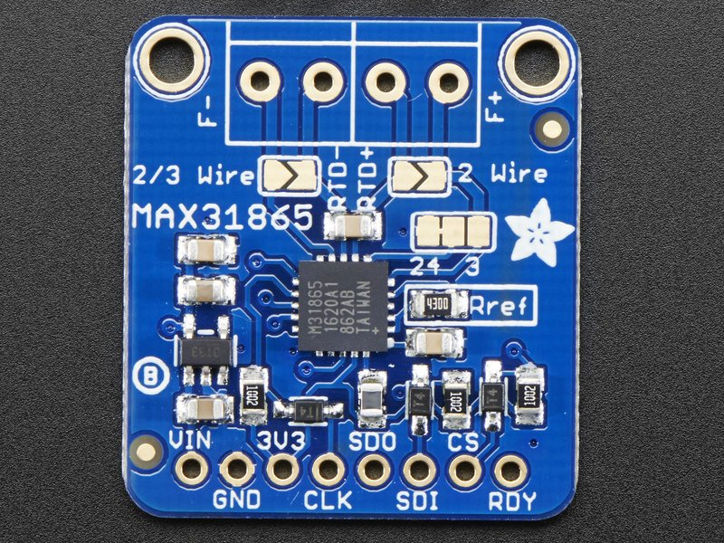

# MAX31865 - Resistance Temperature Detector Amplifier

The MAX31865 device is a SPI interface Resistance Temperature Detector to Digital Converter.

## Sensor Image



## Known limitations

This version only performs the one shot temperature conversion and not the continuous temperature conversion.

## Usage

```csharp
SpiConnectionSettings settings = new(0, 0)
{
    ClockFrequency = Max31865.SpiClockFrequency,
    Mode = Max31865.SpiMode1,
    DataFlow = Max31865.SpiDataFlow
};

using SpiDevice device = SpiDevice.Create(settings);
using Max31865 sensor = new(device, PlatinumResistanceThermometerType.PT1000, ResistanceTemperatureDetectorWires.ThreeWire, ElectricResistance.FromOhms(4300));

while (true)
{
    Console.WriteLine($"Temperature: {sensor.Temperature.DegreesCelsius} ℃");

    // wait for 2000ms
    Thread.Sleep(2000);
}
```

**Note:** _You can use any PT100 or PT1000 temperature sensor which has 2/3/4 wires._

An example on how to use the specific MAX31865 device binding is available in the [samples](samples) folder.

## References 

**MAX31865** [datasheet](https://datasheets.maximintegrated.com/en/ds/MAX31865.pdf)
