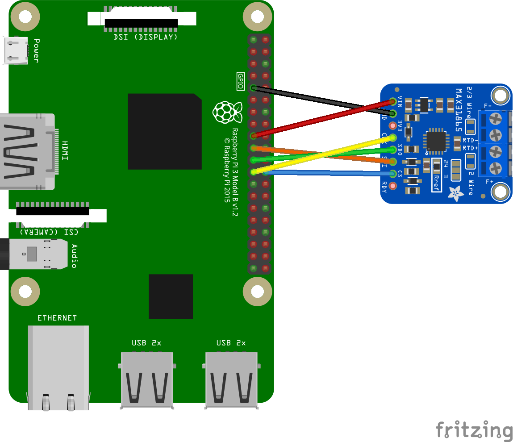

# MAX31865 - Samples

## Hardware Required

* MAX31865
* Male/Female Jumper Wires

## Circuit

The following fritzing diagram illustrates one way to wire up the MAX31865 Resistance Temperature Detector to Digital Converter with a Raspberry Pi



* SDI - MOSI
* SDO - MISO
* CLK - SCLK
* CS  - CE0
* VIN - 3V
* GND - GND

## Code

Define the MAX31865 sensor.

```csharp
SpiConnectionSettings settings = new(0, 0)
{
    ClockFrequency = Max31865.SpiClockFrequency,
    Mode = Max31865.SpiMode1,
    DataFlow = Max31865.SpiDataFlow
};

using SpiDevice device = SpiDevice.Create(settings);
using Max31865 sensor = new(device, PlatinumResistanceThermometerType.PT1000, ResistanceTemperatureDetectorWires.ThreeWire, ElectricResistance.FromOhms(4300));

while (true)
{
    Console.WriteLine($"Temperature: {sensor.Temperature.DegreesCelsius} ℃");

    // wait for 2000ms
    Thread.Sleep(2000);
}
```
