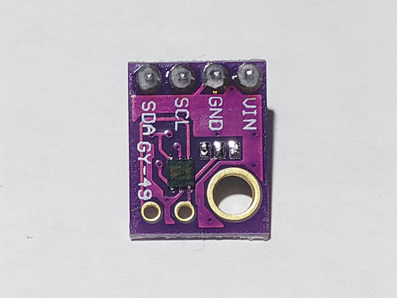

# MAX44009
The MAX44009 ambient light sensor features an I2C digital output that is ideal for a number of portable applications such as smartphones, notebooks, and industrial sensors. At less than 1µA operating current, it is the lowest power ambient light sensor in the industry and features an ultra-wide 22-bit dynamic range from 0.045 lux to 188,000 lux.

## Sensor Image


## Usage
```C#
// set I2C bus ID: 1
// ADS1115 Addr Pin connect to GND
I2cConnectionSettings settings = new I2cConnectionSettings(1, (int)I2cAddress.GND);
// get I2cDevice (in Linux)
UnixI2cDevice device = new UnixI2cDevice(settings);
// get I2cDevice (in Win10)
//Windows10I2cDevice device = new Windows10I2cDevice(settings);

// integration time is 100ms
using (Max44009 sensor = new Max44009(device, IntegrationTime.Time100))
{
    // read illuminance
    double illuminance = sensor.Illuminance;
}
```

## References
https://cdn.datasheetspdf.com/pdf-down/M/A/X/MAX44009_MaximIntegratedProducts.pdf
