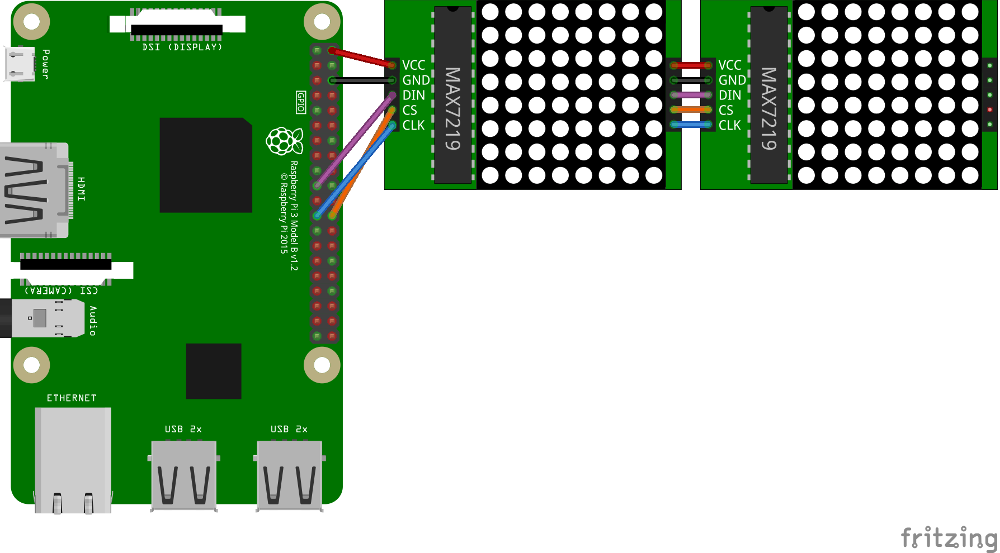

# Using Max7219 (LED Matrix driver)

 You can use [Max7219.cs](Max7219.cs) in your project to drive a Max7219 based Dot Matrix Module. [Write to a 8x8 Dot Matrix Module](samples/README.md) demonstrates a concrete example using this class.

 The following fritzing diagram illustrates one way to wire up the Max7219, with a Raspberry Pi.

