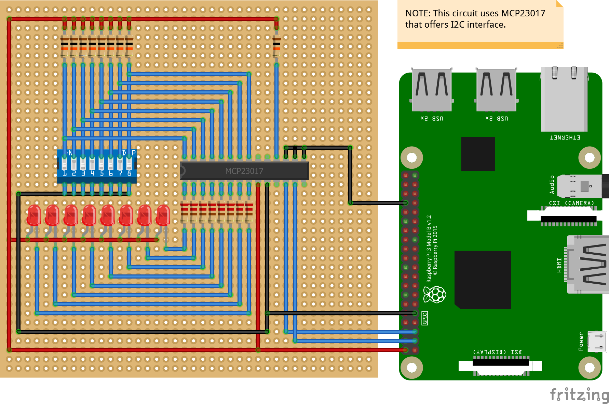

# Mcp23xxx - I/O Expander device family

The MCP23XXX device family provides 8/16-bit, general purpose parallel I/O expansion for I2C or SPI applications.  These devices include a range of addressing schemes and I/O configurations including pull-up resistors, polarity inverting, and interrupts.

## Documentation

- The docuementation from [Adafruit](https://www.adafruit.com/product/732)
- [Learn how to use MCP23008 and MCP23017 with Python](https://learn.adafruit.com/using-mcp23008-mcp23017-with-circuitpython/overview) from the Adafruit learn courses used to create this binding.

### Device Family

MCP23XXX devices contain different markings to distinguish features like interfacing, packaging, and temperature ratings.  For example, MCP23017 contains an I2C interface and MCP23S17 contains a SPI interface.  Please review specific datasheet for more information.

- MCP23X08 [datasheet](http://ww1.microchip.com/downloads/en/DeviceDoc/21919e.pdf)
- MCP23X09 [datasheet](http://ww1.microchip.com/downloads/en/DeviceDoc/20002121C.pdf)
- MCP23X17 [datasheet](http://ww1.microchip.com/downloads/en/DeviceDoc/20001952C.pdf)
- MCP23X18 [datasheet](http://ww1.microchip.com/downloads/en/DeviceDoc/22103a.pdf)

**NOTE**: MCP23X16 contains different internal circuitry and is not compatible with this binding.

## Usage

### Mcp230xx I2C

  

```csharp
// 0x20 is the device address in this example.
var connectionSettings = new I2cConnectionSettings(1, 0x20);
var i2cDevice = I2cDevice.Create(connectionSettings);
var mcp23S17 = new Mcp23017(i2cDevice);
```

### Mcp23Sxx SPI


```csharp
var connectionSettings = new SpiConnectionSettings(0, 0)
{
    ClockFrequency = 1000000,
    Mode = SpiMode.Mode0
};

var spiDevice = SpiDevice.Create(connectionSettings);

// 0x20 is the device address in this example.
var mcp23S17 = new Mcp23S17(spiDevice, 0x20);
```

### Register Banking and Ports

On 16-bit expanders the GPIO ports are grouped into 2 "ports". Via the `IGpioController` interface we expose the pins logically as 0-15, with the first bank being 0-7 and the second being 8-15.

When using `ReadByte()` or `WriteByte()` on the 16-bit chips you can specify `PortA` or `PortB` to write to respective registers. The default is `PortA`. Reading and writing `ushort` writes to both ports.

The internal circuitry has a banking concept to group by port registers or by register type.  This enables different configurations for reading/writing schemes. While we have some support for the bank styles it is not exposed directly. There is no safe way to detect the mode and most other drivers do not support anything but the defaults. You need to derive from `Mcp23xxx` directly.

#### Example for 16-bit device

``` csharp
// Read Port B's Input Polarity Port Register (IPOL).
byte data = mcp23S17.Read(Register.IPOL, Port.PortB);
```

#### Example for 8-bit device

The MCP23X08 only contains 1 port so there is not a choice for port when addressing the register.

``` csharp
// Read port A's GPIO Pull-Up Resistor Register (GPPU).
byte data = mcp23S08.ReadByte(Register.GPPU);
```

### Controller Pins

The `Mcp23xxx` has overloaded pin options when instantiating the device.  This includes a reset line, which is an output pin of the controller to the MCP23XXX RST input pin.  The other pins are interrupt options, which are inputs to the controller from the MCP23XXX INTA/INTB output pins.  They are optional arguments.  Assign as `null` for the pins you don't use.

```csharp
// Pin 10: Reset; Output to Mcp23xxx
// Pin 25: INTA;  Input from Mcp23xxx
// Pin 17: INTB;  Input from Mcp23xxx
var mcp23S17 = new Mcp23S17(spiDevice, 0x20, 10, 25, 17);
```

The MCP23XXX will be in the reset/disabled state by default if you use the reset pin.  You must call the `Enable()` method to activate the device.

```csharp
var mcp23S17 = new Mcp23S17(spiDevice, 0x20, 10, 25, 17);
mcp23S17.Enable();
// Can now communicate with device.

// Turn off again if needed.
mcp23S17.Disable();
```

### Interrupt support

The `Mcp23xxx` has one (8-bit variants) or two (16-bit variants) interrupt pins. These allow external
signalisation on interrupt change. The corresponding pins need to be connected to a master GPIO controller
for this feature to work. You can use a GPIO controller around the MCP device to handle everything
for you:

```csharp
// Gpio controller from parent device (eg. Raspberry Pi)
_gpioController = new GpioController(PinNumberingScheme.Logical);
_i2c = I2cDevice.Create(new I2cConnectionSettings(1, 0x21));
// The "InterruptA" line of the Mcp23017 is connected to GPIO input 11 of the Raspi
_device = new Mcp23017(_i2c, -1, 11, -1, _gpioController, false);
GpioController theDeviceController = new GpioController(PinNumberingScheme.Logical, _device);
theDeviceController.OpenPin(1, PinMode.Input);
theDeviceController.RegisterCallbackForPinValueChangedEvent(1, PinEventTypes.Rising, Callback);
```

Alternatively, you can also manually control the event handling:

```csharp
_gpioController = new GpioController();
_device = I2cDevice.Create(new I2cConnectionSettings(1, 0x21));
// Interrupt pin B is connected to GPIO pin 22
_mcp23017 = new Mcp23017(_device, -1, -1, 22, gpioController, false);
_mcp23017.EnableInterruptOnChange(8, PinEventTypes.Rising | PinEventTypes.Falling); // Enable interrupt for pin 8
_gpioController.RegisterCallbackForPinValueChangedEvent(22, PinEventTypes.Falling, Interrupt);
// Read the interrupt register, to make sure we get any further interrupts
_mcp23017.ReadByte(Register.GPIO, Port.PortB);
```

## Binding Notes

This binding includes an `Mcp23xxx` abstract class and derived abstract classes for 8-bit `Mcp23x0x` and 16-bit `Mcp23x1x` variants.
