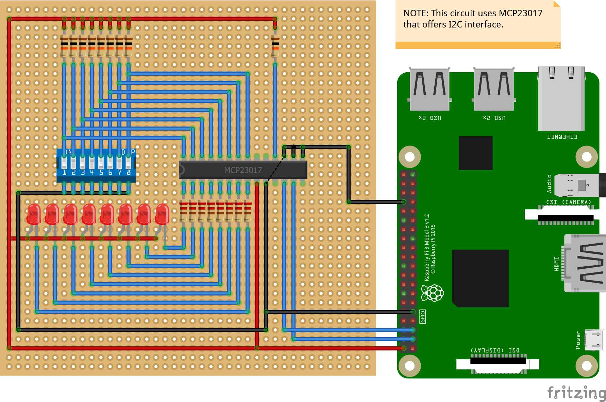

# Microchip Mcp23xxx Samples

## Read switches and write value to LEDs

This example shows how to read from an 8-pin DIP switch and write the value out to 8 LEDs using an MCP23X17 device and a RPi3.

### SPI Interface

### I2C Interface

  
