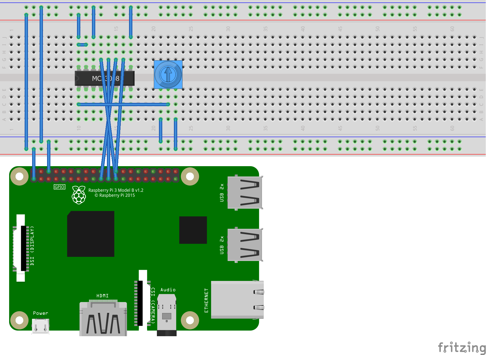

# MCP3008 - 10-bit Analog to Digital Converter

Some devices like the Raspberry Pi cannot read analog values directly so rely on  [analog to digital converters](https://en.wikipedia.org/wiki/Analog-to-digital_converter), like the [MCP3008 ADC](https://www.adafruit.com/product/856). The MCP3008 supports the SPI interface. The 10-bit chip can be accessed as an [SPI device](https://en.wikipedia.org/wiki/Serial_Peripheral_Interface) or manually via raw GPIO pins.

 You can use [Mcp3008.cs](Mcp3008.cs) in your project to access analog devices. [Reading Analog Input from a Potentiometer](samples/README.md) demonstrates a concrete example using this class.

The following fritzing diagram illustrates one way to wire up the Mcp3008, with a Raspberry Pi and a potentiometer.

