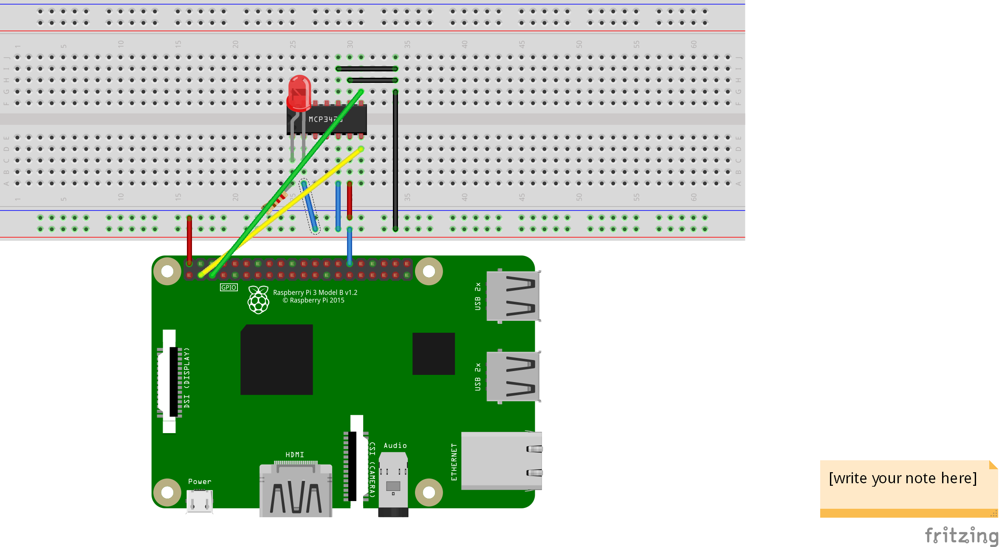

# MCP3428 example

Simple example for measuring LED forward voltage using the MCP3428 ADC and a Raspberry Pi.

```csharp
// I2C addres based on pin configuration
var addr = Mcp3428.AddressFromPins(PinState.Low, PinState.Low);
var options = new I2cConnectionSettings(1, addr);

using (var dev = new UnixI2cDevice(options))
using (var adc = new Mcp3428(dev, ModeEnum.OneShot, ResolutionEnum.Bit16, GainEnum.X1))
{
    var ch1 = adc.ReadChannel(0);

    Console.WriteLine($"LED forward voltage value: {ch1} V");
}
```

Device connection ([some fritzing mess](rpi_led_adc_i2c.png)):


