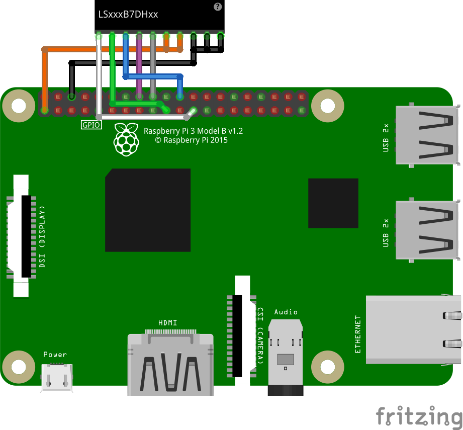

# Connection

All 3 models are using the same connection. This sample used connection below:

To connect to screen, you need a 10-pins 0.5mm FPC connector.

## Recommended Connector (from datasheet 8-2)

Panasonic: AYF531035 (Contact: Bottom side)

SMK FP12 Series: CFP-4610-0150F (Contant: Bottom side)

Molex: 51441-1093 (Contact: Bottom side ) 
