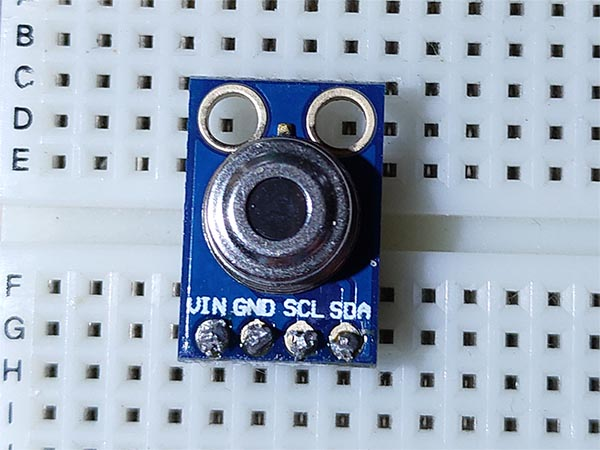

# MLX90614 - Infra Red Thermometer

The MLX90614 is an Infra Red thermometer for noncontact temperature measurements. Both the IR sensitive thermopile detector chip and the signal conditioning ASSP are integrated in the same TO-39 can. Thanks to its low noise amplifier, 17-bit ADC and powerful DSP unit, a high accuracy and resolution of the thermometer is achieved. 

## Sensor Image


## Usage
```C#
I2cConnectionSettings settings = new I2cConnectionSettings(1, Mlx90614.DefaultI2cAddress);
I2cDevice i2cDevice = I2cDevice.Create(settings);

using (Mlx90614 sensor = new Mlx90614(i2cDevice))
{
    // read ambient temperature
    double ambient = sensor.ReadAmbientTemperature().Celsius;
    // read object temperature
    double object = sensor.ReadObjectTemperature().Celsius;
}
```

## References

https://cdn.datasheetspdf.com/pdf-down/M/L/X/MLX90614-Melexis.pdf
