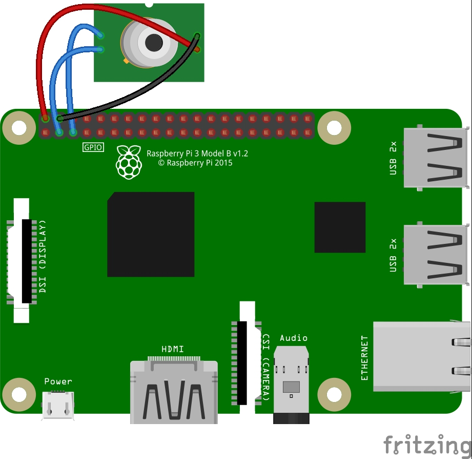

# MLX90614 - Samples

## Hardware Required
* MLX90614
* Male/Female Jumper Wires

## Circuit


* SCL - SCL (GPIO 3)
* SDA - SDA (GPIO 2)
* VCC - 5V/3V
* GND - GND

**Warning: MLX90614 includes 5V and 3V versions!**

## Code
```C#
I2cConnectionSettings settings = new I2cConnectionSettings(1, Mlx90614.DefaultI2cAddress);
I2cDevice i2cDevice = I2cDevice.Create(settings);

using (Mlx90614 sensor = new Mlx90614(i2cDevice))
{
    while (true)
    {
        Console.WriteLine($"Ambient: {sensor.AmbientTemperature.Celsius} ℃");
        Console.WriteLine($"Object: {sensor.ObjectTemperature.Celsius} ℃");
        Console.WriteLine();

        Thread.Sleep(1000);
    }
}
```

## Result

