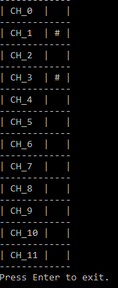

# MPR121 Sample

This sample demonstrates how to read channel statuses using auto-refresh configuration.

### Handling the channel statuses changes

```csharp
mpr121.ChannelStatusesChanged += (object sender, ChannelStatusesChangedEventArgs e) =>
    {
        var channelStatuses = e.ChannelStatuses;
        // do something.
    };
```

### Channel statuses table

The following status means that the **channel 1** and **channel 3** are pressed:

