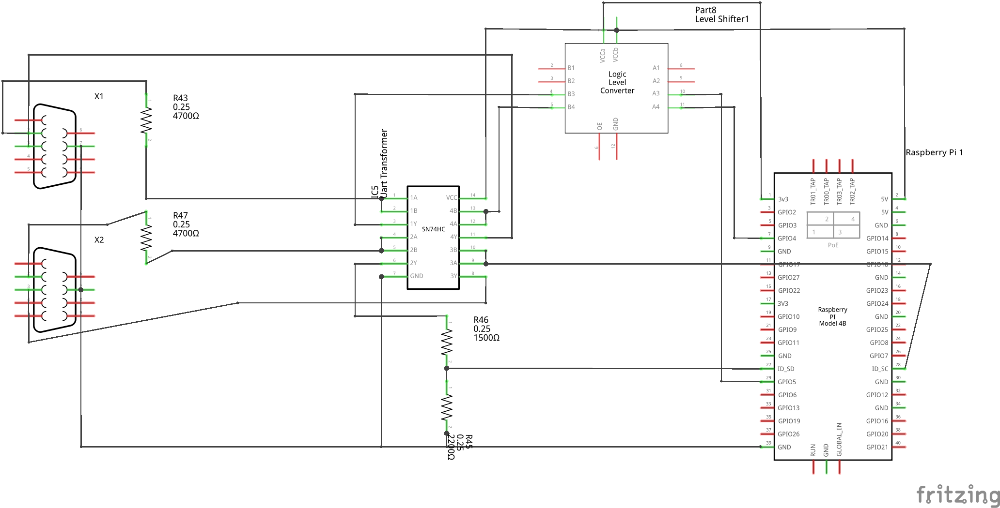

# NMEA 0183 Protocol

## Safety Note

Never rely on electronic aids and their warnings alone for safe navigation. The International Regulations for Preventing Collisions at Sea (COLREG)
states in Rule 5: „Every vessel shall **at all times** maintain a proper look-out by **sight and hearing** as well as by all available means appropriate
in the prevailing circumstances and conditions so as to make a full appraisal of the situation and of the risk of collision.“ It is therefore the
skippers responsibility to maintain proper watchkeeping with all means available.

AIS is a great aid in avoiding collisions and foreseeing dangerous close encounters with other vessels, but it can never act as sole source
of information. There's no guarantee for it's seamless operation and there are still a large number of smaller ships that are not equipped with AIS
transponders.

## Summary for NMEA support

NMEA stands for `National Marine Electronics Associations`.

NMEA 0183 is an industry standard first released in 1983 and has been updated several times since then. It is used as a standard protocol
for communication between different sensors and devices on a boat, but has been adapted for other uses as well. Most GNSS receivers
support some variant of the NMEA protocol as output. On a boat, other sensors that support the protocol include wind sensors, depth transducers
or electronic compasses. The data is interpreted and combined by displays, chart plotters or autopilots.

On the physical layer, NMEA uses a serial protocol on an RS-232 interface. Historically, the baud rate is limited to 4800 baud, however
most recent devices support configuring higher baud rates. Since RS-232 only supports point-to-point connections, message routers are
required to combine multiple data sources. Chart plotters for NMEA 0183 have several inputs for different sensors.

NMEA 0183 has been superseeded by NMEA 2000, which uses a CAN-Bus protocol and hardware layer and can therefore run a large number of sensors on a single cable.
Since NMEA 0183 is much simpler to parse and does not require specific electronic components, it is still in wide use. Bi-directional converters
from NMEA 0183 to NMEA 2000 are available from different vendors.

In NMEA 0183 a device is either a talker or a listener. There are multiple types of sentences (or messages) which can be sent or received.
Each message has a talker identifier (see `TalkerIdentifier`), sentence identifier (see `SentenceId`), fields and optional checksum.

The following sentence ids are currently supported:

- AIVDM/AIVDO: AIS messages (see below)
- BOD: Bearing origin to destination
- BWC: Bearing and distance to waypoint
- DBS: Depth below surface
- GGA: GNSS fix data
- GLL: Position fast update
- GSV: Satellites in view
- HDG: Heading and deviation
- HDM: Heading, magnetic
- HDT: Heading, true
- MDA: Meterological information
- MWD: Wind direction absolute
- MWV: Wind Speed and angle (both true and apparent)
- PCDIN: (partial) Used to wrap NMEA2000 engine parameter sets. Message types 0x01F200, 0x01F201, 0x01F211
- RMB: Recommended navigation to destination (for autopilot)
- RMC: Recommended minimum navigation sentence
- RPM: Engine revolutions
- RTE: Route
- VHW: Speed trough water
- VTG: Speed and course over ground
- WPT: Waypoints
- XDR: Transducer measurement (for a variety of sensors)
- XTE: Cross track error
- ZDA: Date and time

All supported messages can both be parsed as well as sent out. Therefore it's possible to recieve GNSS data from a NMEA 2000 network and
send temperature data from an attached DHT11 sensor back to the network.

A `MessageRouter` class is available that can be used to route messages between different interfaces (the Raspberry Pi 4 supports up to
6 RS-232 interfaces, not including USB-to-Serial adapters). Unsupported messages can still be routed around as Raw messages. AIS Messages (AIVDM and AIVDO) are also routed as raw messages, but can be decoded using the separate `AisManager` class.

## AIS Decoding

AIS (Automatic Identification System) is a System that automatically provides information about nearby ships by radio. All larger ships must be equipped with a transceiver (sender) that sends the own vessel's position regularly to all nearby vessels. Smaller ships such as yachts can be equipped as well, and many sea-going yachts are, because the system adds a high level of security. All vessels that are equipped with a receiver for this AIS data (typically embedded into a VHF radio) can see the position and speed, as well as the names of other vessels directly on a display or the chart plotter.

The `AisManager` class decodes AIS messages encoded in AIVDM/AIVDO sentences. Just forward the entire data stream to an instance of it (or use the `MessageRouter` for this purpose).

```csharp

_manager = new AisManager("AIS", 12345, "MyVessel");
using NmeaTcpClient client = new NmeaTcpClient("TcpClient", "localhost");
client.OnNewSequence += (source, msg) =>
{
    _manager.SendSentence(source, msg);
};

client.StartDecode();
// ...
var shipsInView = _manager.GetSpecificTargets<Ship>(); // Get the list of currently visible ships.
```

## References

The NMEA 0183 Standard was never publicly published. The NMEA standard committee makes it available on its website only for a considerable fee.
However, several websites have information about how to decode the different messages. In some special cases,
the available documentation is ambiguous or contradictory, though.

- [Official NMEA Website](https://www.nmea.org/)
- [NMEA Command documentation (one of several available on the web)](http://www.tronico.fi/OH6NT/docs/NMEA0183.pdf)

## Samples

This demonstrates a simple, synchronous parser for a simple receiver:

```csharp
DateTimeOffset lastMessageTime = DateTimeOffset.UtcNow;
using (var sp = new SerialPort("/dev/ttyS0"))
{
    sp.NewLine = "\r\n";
    sp.Open();

    // Device streams continuously and therefore most of the time we would end up in the middle of the line
    // therefore ignore first line so that we align correctly
    sp.ReadLine();

    bool gotRmc = false;
    while (!gotRmc)
    {
        string line = sp.ReadLine();
        TalkerSentence? sentence = TalkerSentence.FromSentenceString(line, out _);

        if (sentence == null)
        {
            continue;
        }

        object? typed = sentence.TryGetTypedValue(ref lastMessageTime);
        if (typed == null)
        {
            Console.WriteLine($"Sentence identifier `{sentence.Id}` is not known.");
        }
        else if (typed is RecommendedMinimumNavigationInformation rmc)
        {
            gotRmc = true;

            if (rmc.Position.ContainsValidPosition())
            {
                Console.WriteLine($"Your location: {rmc.Position}");
            }
            else
            {
                Console.WriteLine($"You cannot be located.");
            }
        }
        else
        {
            Console.WriteLine($"Sentence of type `{typed.GetType().FullName}` not handled.");
        }
    }
}
```

See the [samples directory](samples/NmeaSimulator) for a simple NMEA simulator (generates sentences for a trip along a path)

For asynchronous message processing (the recommended use) several "message sources or sinks" are available. The default
interface is `NmeaParser`. It is used as follows:

```csharp
_serialPortShip = new SerialPort("/dev/ttyAMA1", 115200);
_serialPortShip.Open();
_streamShip = _serialPortShip.BaseStream;
_parserShipInterface = new NmeaParser("Ship", _streamShip, _streamShip); // Use same stream for input and output
_parserShipInterface.OnParserError += OnParserError;
_parserShipInterface.OnNewPosition += OnNewPosition;
_parserShipInterface.StartDecode(); // Start the processing thread.
```

TCP and UDP servers are also available, they can be used to forward data to navigation software such as [OpenCPN](https://opencpn.org/index.html) or
[SignalK](https://signalk.org/). The servers just offer the transport connection, they must be fed with data to be forwarded.

```csharp
_openCpnServer = new NmeaTcpServer("OpenCPN", IPAddress.Any, 10100);
_openCpnServer.OnParserError += OnParserError;
_openCpnServer.StartDecode();

_udpServer = new NmeaUdpServer("UDP", 10101);
_udpServer.OnParserError += OnParserError;
_udpServer.StartDecode();
```

Advanced use cases should use the `MessageRouter` to combine different message sources and sinks. This can be used for instance to forward data
from a serial port to a TCP server to be used by OpenCPN while simultaneously feeding the output data to an auto pilot on a different interface.

```csharp
_clockSynchronizer = new SystemClockSynchronizer();
_clockSynchronizer.StartDecode();

_router = new MessageRouter(new LoggingConfiguration() { Path = "/home/pi/projects/ShipLogs", MaxFileSize = 1024 * 1024 * 5 , SortByDate = true });

_cache = new SentenceCache(_router);
_autopilot = new AutopilotController(_router, _router, _cache);

// Configure message sources and sinks
_router.AddEndPoint(_parserShipInterface);
_router.AddEndPoint(_openCpnServer);
_router.AddEndPoint(_signalkServer);
_router.AddEndPoint(_clockSynchronizer);
_router.AddEndPoint(_udpServer);

// When using the router, only the router's `OnNewSequence` event should be used for local processing. 
// This is known as the "local" sink.
_router.OnNewSequence += ParserOnNewSequence;
foreach (var rule in ConstructRules())
{
    _router.AddFilterRule(rule);
}

```

Filter rules are used to tell the router which messages from which source need to be routed where.

```csharp
        public IList<FilterRule> ConstructRules()
        {
            TalkerId yd = new TalkerId('Y', 'D'); // This is the NMEA-2000 interface. It provides GNSS, depth and wind information
            // Note: Order is important. First ones are checked first
            IList<FilterRule> rules = new List<FilterRule>();
            // Log just everything, but of course continue processing
            rules.Add(new FilterRule("*", TalkerId.Any, SentenceId.Any, new []{ MessageRouter.LoggingSinkName }, false, true));
            // The time message is required by the time component
            rules.Add(new FilterRule("*", TalkerId.Any, new SentenceId("ZDA"), new []{ _clockSynchronizer.InterfaceName }, false, true));
            // GGA messages from the ship are sent to OpenCPN
            rules.Add(new FilterRule("*", yd, new SentenceId("GGA"), new[] {"OpenCPN"}, false, true));
            // Same applies for this.
            rules.Add(new FilterRule("*", yd, new SentenceId("RMC"), new[] {"OpenCPN"}, false, true));
            // And these.
            rules.Add(new FilterRule("*", yd, new SentenceId("GLL"), new[] {"OpenCPN"}, false, true));
            rules.Add(new FilterRule("*", yd, new SentenceId("VTG"), new[] {"OpenCPN"}, false, true));
            rules.Add(new FilterRule("*", yd, new SentenceId("GSV"), new[] {"OpenCPN"}, false, true));
            rules.Add(new FilterRule("*", yd, new SentenceId("GSA"), new[] {"OpenCPN"}, false, true));
            // Drop this, it's wrong (seems not to use the heading, even if it should).
            // We're instead reconstructing this message - but in that case, don't send it back to the ship, as this causes confusion
            // for the wind displays
            rules.Add(new FilterRule("*", yd, WindDirectionWithRespectToNorth.Id, new List<string>(), false, false));
            rules.Add(new FilterRule(MessageRouter.LocalMessageSource, TalkerId.ElectronicChartDisplayAndInformationSystem, WindDirectionWithRespectToNorth.Id, new List<string>() { OpenCpn, SignalKOut, Udp }, false, false));
            // Anything from the local software (i.e. IMU data, temperature data) is sent to the ship and other nav software
            rules.Add(new FilterRule(MessageRouter.LocalMessageSource, TalkerId.Any, SentenceId.Any, new[] { "Ship"", "OpenCPN", "UDP" }, false, true));

            // Anything from OpenCpn is distributed everywhere
            rules.Add(new FilterRule("OpenCPN"", TalkerId.Any, SentenceId.Any, new [] { "Ship" }));
            // Anything from the ship is sent locally
            rules.Add(new FilterRule("Ship"", TalkerId.Any, SentenceId.Any, new [] { "OpenCPN", MessageRouter.LocalMessageSource, "UDP" }, false, true));
            
            // Send the autopilot anything he can use, but only from the ship (we need special filters to send him info from ourselves, if there are any)
            string[] autoPilotSentences = new string[]
            {
                "APB", "APA", "RMB", "XTE", "XTR",
                "BPI", "BWR", "BWC",
                "BER", "BEC", "WDR", "WDC", "BOD", "WCV", "VWR", "VHW"
            };
            foreach (var autopilot in autoPilotSentences)
            {
                // - Maybe we need to be able to switch between using OpenCpn and the Handheld for autopilot / navigation control
                // - For now, we forward anything from our own processor to the real autopilot and the ship (so it gets displayed on the displays)
                rules.Add(new FilterRule(MessageRouter.LocalMessageSource, TalkerId.Any, new SentenceId(autopilot), new []{ HandheldSourceName }, false, true));
            }

            // The messages VWR and VHW (Wind measurement / speed trough water) come from the ship and need to go to the autopilot
            rules.Add(new FilterRule(ShipSourceName, TalkerId.Any, new SentenceId("VWR"), new[] { HandheldSourceName }, true, true));
            rules.Add(new FilterRule(ShipSourceName, TalkerId.Any, new SentenceId("VHW"), new[] { HandheldSourceName }, true, true));

            return rules;
        }
```

## A note on the use of serial ports on the Raspberry Pi

The Raspberry Pi 4 has up to 6 UART interfaces that can be enabled. UART0 on GPIO pins 14 and 15 is enabled by default, the others can be
enabled using overlays configured in `/boot/firmware/config.txt`. The following entries add UARTS 2 and 3 on GPIO Pins 0/1 and 4/5 respectively:

> [!Note]
> Prior to *Bookworm*, Raspberry Pi OS stored the boot partition at `/boot/`. Since Bookworm, the boot partition is located at `/boot/firmware/`. Adjust the previous line to be `sudo nano /boot/firmware/config.txt` if you have an older OS version.

```text
enable_uart=1
dtoverlay=UART2
dtoverlay=UART3
```

Pins 0 and 1 are normally reserved for Pi HATs with an EPROM, but you can freely use these two pins if you don't use a HAT.

> Important: All of the pins use 3.3V TTL logic. The RS-232 standard dates back to the 1960ies, when much higher voltages were used in communication equipment.
The standard uses logic levels between -15 and +15V. While most devices will understand levels around 5V, any input should be able to
accept at least 15V. Therefore, to avoid frying your Pi, extra electronics is required for level adjustment. There are special breakout
boards available for the Pi for this purpose, but I have found them to be unreliable and error-prone (e.g. they cause local echo).

The following diagram shows two alternative approaches using a level shifter or just a simple inverter. The SN74HC is actually a
4 Port NAND gate, but used as inverter here. (To convert from TTL logic to RS-232 logic, the voltage has to be increased and the
signal needs to be inverted.) One can use any kind of inverting logic gate, as long as it is a piece that can accept input voltages
in excess of VDD. The data sheet will say something like "The input and output voltage ratings may be exceeded if the input and output
current ratings are observed" under the "Absolute maximum ratings" section.



## Guidelines for adding new sentence identifiers

- Base a new sentence identifier on [RMC sentence](Sentences/RecommendedMinimumNavigationInformation.cs)
- Modify `GetKnownSentences` in [TalkerSentence.cs](TalkerSentence.cs) or call `TalkerSentence.RegisterSentence` in the beginning of your `Main` method
