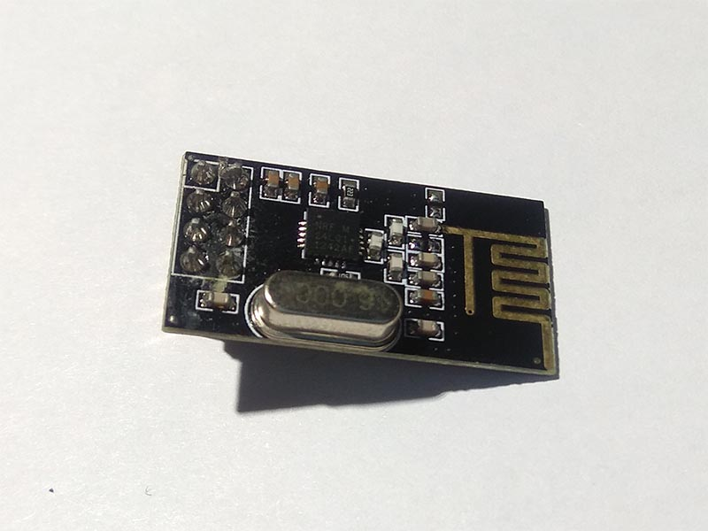

# nRF24L01
The nRF24L01 is a single chip radio transceiver for the world wide 2.4 - 2.5 GHz ISM band.

## Sensor Image


## Usage
```C#
SpiConnectionSettings settings = new SpiConnectionSettings(0, 0)
{
    ClockFrequency = Nrf24l01.SpiClockFrequency,
    Mode = Nrf24l01.SpiMode
};
UnixSpiDevice device = new UnixSpiDevice(settings);

using (Nrf24l01 sensor = new Nrf24l01(receiverDevice, 5, 6, 20))
{
    // Binding DataReceived event
    sensor.DataReceived += Receiver_ReceivedData;

    // Loop
    while (true)
    {
        sensor.Send(Encoding.UTF8.GetBytes("Hello! .NET Core IoT"));

        Thread.Sleep(2000);
    }
}

// DataReceived event
private static void Receiver_ReceivedData(object sender, DataReceivedEventArgs e)
{
    var raw = e.Data;
    var res = Encoding.UTF8.GetString(raw);

    Console.Write("Received Raw Data: ");
    foreach (var item in raw)
    {
        Console.Write($"{item} ");
    }
    Console.WriteLine();

    Console.WriteLine($"Massage: {res}");
    Console.WriteLine();
}
```

## References
https://cdn.datasheetspdf.com/pdf-down/N/R/F/NRF24L01-Nordic.pdf
