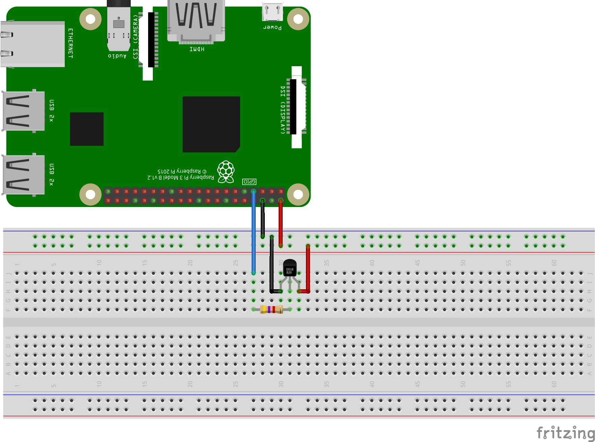

# 1-wire

Allows using 1-wire devices such as digital thermometers (i.e. MAX31820, DS18B20). See [sample](./samples/Program.cs) for how to use.

## Documentation

- [dtoverlay](https://pinout.xyz/pinout/1_wire)

## Board

The following diagram demonstrates how you should wire your device in order to run the program. It uses the GND, 5V and GPIO4 pins on the Raspberry Pi.



## Usage

```csharp
using System;
using System.Linq;
using System.Threading.Tasks;
using Iot.Device.OneWire;

// Make sure you can access the bus device before requesting a device scan (or run using sudo)
// $ sudo chmod a+rw /sys/bus/w1/devices/w1_bus_master1/w1_master_*
if (args.Any(_ => _ == "temp"))
{
    // Quick and simple way to find a thermometer and print the temperature
    foreach (var dev in OneWireThermometerDevice.EnumerateDevices())
    {
        Console.WriteLine($"Temperature reported by '{dev.DeviceId}': " +
                            (await dev.ReadTemperatureAsync()).DegreesCelsius.ToString("F2") + "\u00B0C");
    }
}
else
{
    // More advanced way, with rescanning the bus and iterating devices per 1-wire bus
    foreach (string busId in OneWireBus.EnumerateBusIds())
    {
        OneWireBus bus = new(busId);
        Console.WriteLine($"Found bus '{bus.BusId}', scanning for devices ...");
        await bus.ScanForDeviceChangesAsync();
        foreach (string devId in bus.EnumerateDeviceIds())
        {
            OneWireDevice dev = new(busId, devId);
            Console.WriteLine($"Found family '{dev.Family}' device '{dev.DeviceId}' on '{bus.BusId}'");
            if (OneWireThermometerDevice.IsCompatible(busId, devId))
            {
                OneWireThermometerDevice devTemp = new(busId, devId);
                Console.WriteLine("Temperature reported by device: " +
                                    (await devTemp.ReadTemperatureAsync()).DegreesCelsius.ToString("F2") +
                                    "\u00B0C");
            }
        }
    }
}
```

## How to setup 1-wire on Raspberry Pi

Add the following to `/boot/firmware/config.txt` to enable 1-wire protocol. The default gpio is 4 (pin 7).

> [!Note]
> Prior to *Bookworm*, Raspberry Pi OS stored the boot partition at `/boot/`. Since Bookworm, the boot partition is located at `/boot/firmware/`. Adjust the previous line to be `sudo nano /boot/firmware/config.txt` if you have an older OS version.

```text
dtoverlay=w1-gpio
```

Add this to specify gpio 17 (pin 11).

```text
dtoverlay=w1-gpio,gpiopin=17
```

## Supported devices

All temperature devices with family id of 0x10, 0x28, 0x3B, or 0x42 supported.

- [MAX31820](https://datasheets.maximintegrated.com/en/ds/MAX31820.pdf)
- [DS18B20](https://datasheets.maximintegrated.com/en/ds/DS18B20.pdf)

## Testing with custom sysfs paths

The `OneWireBus`, `OneWireDevice`, and `OneWireThermometerDevice` classes accept custom sysfs paths via constructor overloads, enabling integration testing without physical hardware.

```csharp
// Create a fake sysfs directory structure for testing
string testBusPath = "/path/to/test/bus/w1/devices";
string testDevicesPath = "/path/to/test/devices";

// Create bus with custom paths
var bus = new OneWireBus("w1_bus_master1", testBusPath, testDevicesPath);

// Enumerate devices from custom paths
foreach (string devId in bus.EnumerateDeviceIds())
{
    Console.WriteLine(devId);
}

// Create thermometer device with custom path
var thermometer = new OneWireThermometerDevice("w1_bus_master1", "28-00000abcdef", testDevicesPath);
var temperature = thermometer.ReadTemperature();
```
