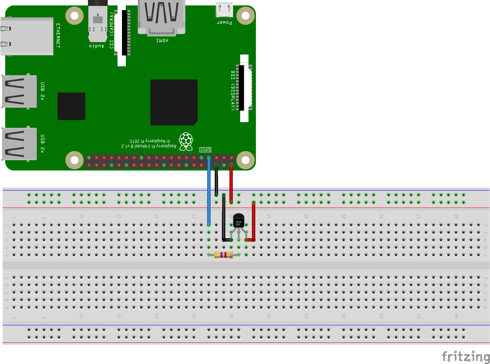

# 1-wire temperature sensor sample

Run this example to see how to read the temperature from a 1-wire sensor connected to a Raspberry Pi.

## Breadboard layout for DS18B20

The following [fritzing diagram](onewire-temp.fzz) demonstrates how you should wire your device in order to run the program. It uses the GND, 5V and GPIO4 pins on the Raspberry Pi.

