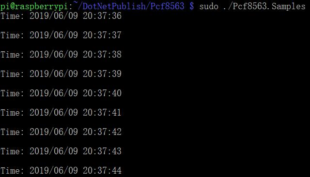

# PCF8563 - Samples

## Hardware Required
* PCF8563
* Male/Female Jumper Wires

## Circuit


* SCL - SCL
* SDA - SDA
* VCC - 5V
* GND - GND

## Code
```C#
I2cConnectionSettings settings = new I2cConnectionSettings(1, Pcf8563.DefaultI2cAddress);
I2cDevice device = I2cDevice.Create(settings);

using (Pcf8563 rtc = new Pcf8563(device))
{
    rtc.DateTime = DateTime.Now;

    while (true)
    {
        DateTime dt = rtc.DateTime;

        Console.WriteLine($"Time: {dt.ToString("yyyy/MM/dd HH:mm:ss")}");
        Console.WriteLine();

        Thread.Sleep(1000);
    }
}
```

## Result

