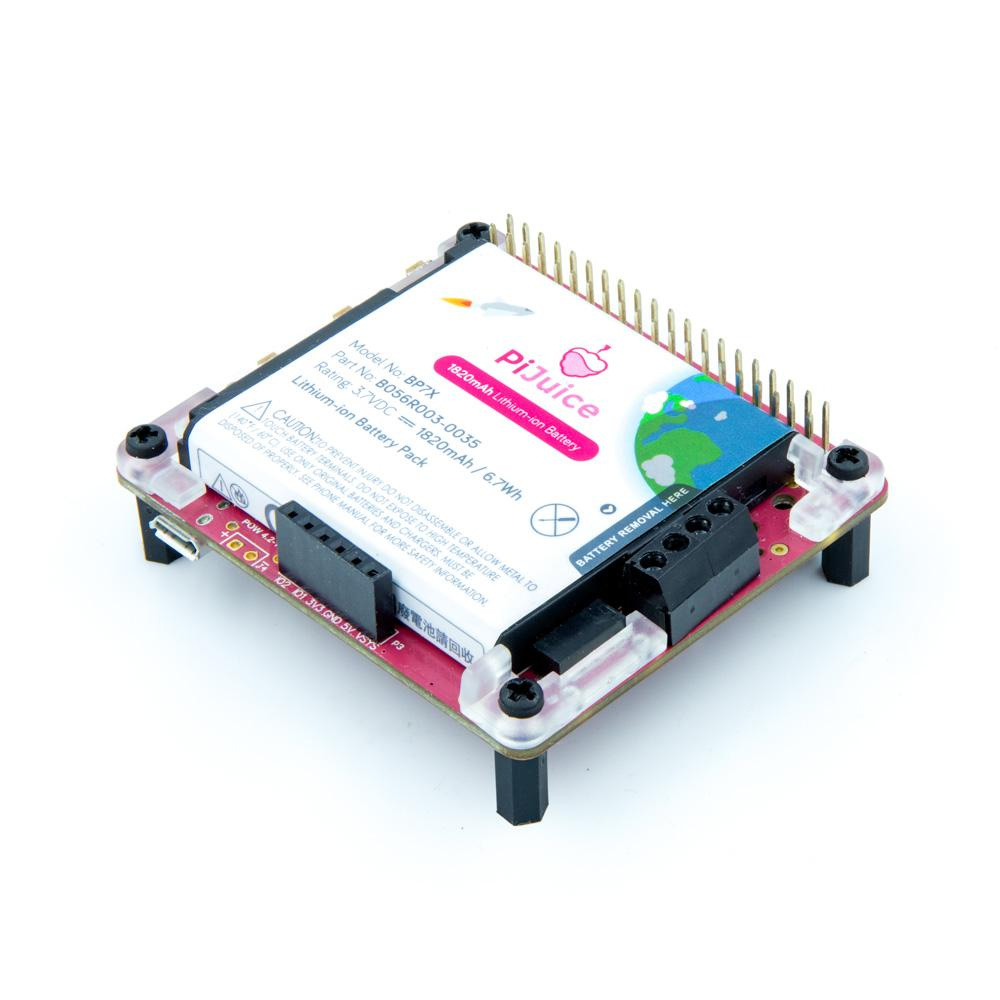

# PiJuice

## Summary

You will need a PiJuice from [Pi Supply](https://uk.pi-supply.com/products/pijuice-standard/) and a Raspberry Pi.

PiJuice is a fully uninterruptable / uninterupted power supply that will always keep your Raspberry Pi powered! It has a real time clock (RTC) for time tracking and scheduled tasks when the Pi is offline (as well as remote on/off of your Pi). It also has an integrated microcontroller (MCU) chip which will manage soft shut down functionality, a true low power deep sleep state and intelligent start up.

- [Device family](./README.md#device-family)
- [PiJuice requirements](./README.md#make-sure-you-have-a-PiJuice)
- [Known limitations](./README.md#known-limitations)
- [Accessing PiJuice information](./README.md#accessing-PiJuice-information)
- [Usage](./README.md#Usage)

## Device family

The device supported is the PiSupply [PiJuice](https://uk.pi-supply.com/products/pijuice-standard/).



## Make sure you have a PiJuice

There are multiple versions of the PiJuice, this code should work with all version but has only been tested against the last version PiJuice version 1.4 on the Raspberry Pi. We do recommend you to use the latest firmware of the PiJuice. To update PiJuice firmware, please check the [PiJuice GitHub](https://github.com/PiSupply/PiJuice/tree/master/Firmware).

## Known limitations

This version does not include the following functionality

- RTC
- RTC Alarms

## How to use the driver

The main [PiJuice samples](./samples) contains a series of test showing how to use some of the classes.

Create a ```PiJuice``` class.

```csharp
I2cConnectionSettings i2CConnectionSettings = new I2cConnectionSettings(1, PiJuice.DefaultI2cAddress);
piJuice = new PiJuice(I2cDevice.Create(i2CConnectionSettings));
// Do something with the PiJuice
// At the end, the I2C Device will be disposed
```

### Accessing PiJuice information

The PiJuiceInfo class offers information like the firmware version, manufacturer. You can easily access them like in the following code:

```csharp
I2cConnectionSettings i2CConnectionSettings = new I2cConnectionSettings(1, PiJuice.DefaultI2cAddress);
piJuice = new PiJuice(I2cDevice.Create(i2CConnectionSettings));
Console.WriteLine($"Manufacturer :{piJuice.PiJuiceInfo.Manufacturer}");
Console.WriteLine($"Board: {piJuice.PiJuiceInfo.Board}");
Console.WriteLine($"Firmware version: {piJuice.PiJuiceInfo.FirmwareVersion}");
```

## Usage

A series of hardware tests for sensors are available in [GrovePi.samples](./samples). Those hardware tests offers a variety of sensors.

```csharp
Console.WriteLine("Hello GrovePi!");
PinLevel relay = PinLevel.Low;
I2cConnectionSettings i2CConnectionSettings = new I2cConnectionSettings(1, GrovePi.GrovePiSefaultI2cAddress);
grovePi = new GrovePi(I2cDevice.Create(i2CConnectionSettings));
Console.WriteLine($"Manufacturer :{grovePi.GrovePiInfo.Manufacturer}");
Console.WriteLine($"Board: {grovePi.GrovePiInfo.Board}");
Console.WriteLine($"Firmware version: {grovePi.GrovePiInfo.SoftwareVersion}");
grovePi.PinMode(GrovePort.AnalogPin0, PinMode.Input);
grovePi.PinMode(GrovePort.DigitalPin2, PinMode.Output);
grovePi.PinMode(GrovePort.DigitalPin3, PinMode.Output);
grovePi.PinMode(GrovePort.DigitalPin4, PinMode.Input);
UltrasonicSensor ultrasonic = new UltrasonicSensor(grovePi, GrovePort.DigitalPin6);
DhtSensor dhtSensor = new DhtSensor(grovePi, GrovePort.DigitalPin7, DhtType.Dht11);
int poten = 0;
while (!Console.KeyAvailable)
{
    poten = grovePi.AnalogRead(GrovePort.AnalogPin0);
    Console.WriteLine($"Potentiometer: {poten}");
    relay = (relay == PinLevel.Low) ? PinLevel.High : PinLevel.Low;
    grovePi.DigitalWrite(GrovePort.DigitalPin2, relay);
    Console.WriteLine($"Relay: {relay}");
    grovePi.AnalogWrite(GrovePort.DigitalPin3, (byte)(poten * 100 / 1023));
    Console.WriteLine($"Button: {grovePi.DigitalRead(GrovePort.DigitalPin4)}");
    Console.WriteLine($"Ultrasonic: {ultrasonic}");
    dhtSensor.ReadSensor();
    Console.WriteLine($"{dhtSensor.DhtType}: {dhtSensor}");
    Thread.Sleep(2000);
    Console.CursorTop -= 5;
}

Console.CursorTop += 5;
```
