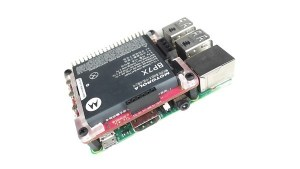

# PiJuice sample

You can refer to the main documentation to understand how to use PiJuice. This example uses multiple sensors. All of them can be found in the basic Grove Start Kit.

Once you have PiJuice on a Raspberry Pi, it looks like this:

See the PiJuice binding [documentation ](../README.md) for more information and how to use PiJuice.
