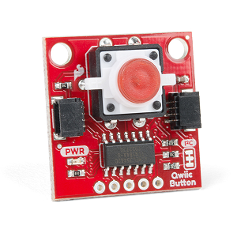
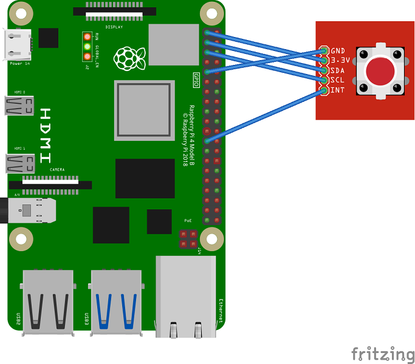

# SparkFun Qwiic Button

## Summary

The [SparkFun](https://www.sparkfun.com) Qwiic Button is an [I2C](https://en.wikipedia.org/wiki/I%C2%B2C) based button with a built-in LED.

In addition to handling blinking and debouncing, the Qwiic Button has configurable interrupts that can be configured to activate upon a button press or click. The Qwiic Button also contains a FIFO queue where it keeps an internal record of when the button was pressed.



At a glance:

-   12mm LED button rated for 50mA
-   Configurable LED blinking
-   Configurable I2C address
-   Configurable interrupts
-   FIFO queue

## Device Family

Compatible with devices capable of acting as I2C master, such as the [Raspberry Pi](https://www.raspberrypi.org).

## Fritzing Diagram

The following [Fritzing](https://fritzing.org) diagram shows how to connect a Raspberry Pi 4 to the Qwiic Button:



## Binding Notes

This binding is a port of SparkFun's [Qwiic Button Arduino Library](https://github.com/sparkfun/SparkFun_Qwiic_Button_Arduino_Library) (MIT licensed).

The functionality of the button is demonstrated in the samples. Below are code samples of some common usage scenarios.

### Detect Button Is Pressed Using Polling

The method `QwiicButton.IsPressed()` indicates whether the button has been pressed:

```c#
using (var button = new QwiicButton(i2cBusId: 1, i2cAddress: 111))
{
    while (!Console.KeyAvailable)
    {
        // Check if button is pressed, and tell us if it is!
        if (button.IsPressed())
        {
            Console.WriteLine("The button is pressed!");
            while (button.IsPressed())
            {
                Thread.Sleep(10); // Wait for user to stop pressing
            }

            Console.WriteLine("The button is not pressed anymore!");
        }

        Thread.Sleep(20); // Don't hammer too hard on the I2C bus
    }
}
```

### Detect Button Is Pressed Using an Interrupt

Interrupts are handled by a `GpioController` instance that listens for events on a GPIO pin.
Below is an example that uses the Raspberry Pi's GPIO pin 23:

```c#
private QwiicButton _button;

public void Run()
{
    using (_button = new QwiicButton(i2cBusId: 1, i2cAddress: 111))
    {
        Initialize();
        Console.ReadKey(); // Block the thread and wait for OnValueChanged to be invoked
    }
}

private void Initialize()
{
    var gpioController = new GpioController(PinNumberingScheme.Board, new RaspberryPi3Driver());
    gpioController.OpenPin(pinNumber: 23, PinMode.Input);
    gpioController.RegisterCallbackForPinValueChangedEvent(
        pinNumber: 23,
        PinEventTypes.Falling,
        OnValueChanged);

    _button.EnablePressedInterrupt(); // Configure the interrupt pin to go low when we press the button
    _button.EnableClickedInterrupt(); // Configure the interrupt pin to go low when we click the button
    _button.ClearEventBits(); // Once event bits are cleared, interrupt pin goes high
}

private void OnValueChanged(object sender, PinValueChangedEventArgs e)
{
    if (e.ChangeType != PinEventTypes.Falling)
    {
        return;
    }

    Console.WriteLine("Pin value changed - interrupt received!");

    if (_button.IsPressed())
    {
        Console.WriteLine("The button is pressed!");
    }

    if (_button.HasBeenClicked())
    {
        Console.WriteLine("The button has been clicked!");
    }

    _button.ClearEventBits(); // Once event bits are cleared, interrupt pin goes high
    Thread.Sleep(15);
}
```

## References

-   [Schematic](https://cdn.sparkfun.com/assets/8/b/a/2/f/Qwiic_Button.pdf)
-   [Eagle Files](https://cdn.sparkfun.com/assets/f/7/1/8/8/Qwiic_Button.zip)
-   [Board Dimensions](https://cdn.sparkfun.com/assets/learn_tutorials/1/1/0/8/SparkFun_Qwiic_Button_Board_Dimensions.png)
-   [Register Map](https://cdn.sparkfun.com/assets/learn_tutorials/1/1/0/8/Qwiic_Button_I2C_Register_Map.pdf)
-   [GitHub Hardware Repo](https://github.com/sparkfun/Qwiic_Button)
