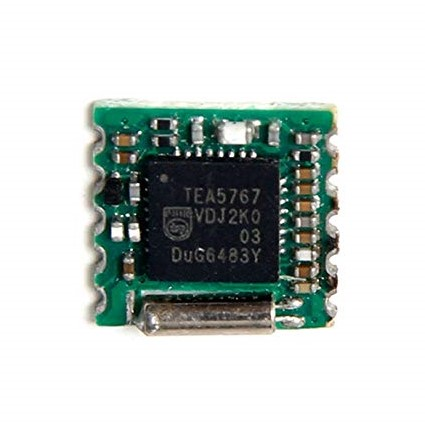

# TEA5767 - Radio Receiver

The TEA5767HN is a single-chip electronically tuned FM stereo radio for low-voltage applications with fully integrated Intermediate Frequency (IF) selectivity and demodulation.

## Sensor Image



## Usage

```csharp
I2cConnectionSettings settings = new I2cConnectionSettings(1, Tea5767.DefaultI2cAddress);
I2cDevice device = I2cDevice.Create(settings);

// The radio is running on FM 103.3MHz
using (Tea5767 radio = new Tea5767(device, FrequencyRange.Other, 103.3))
{
    // Automatic search from current frequency up
    // The larger stopLevel, the fewer radio stations can be searched.
    radio.Search(searchDirection: SearchDirection.Up, stopLevel: 3);
}
```
