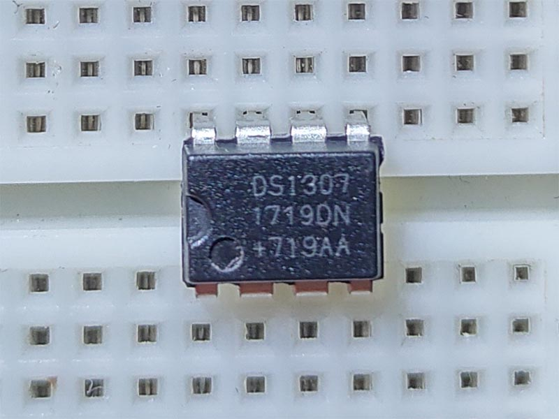

# DS1307 - Realtime Clock

The DS1307 serial real-time clock (RTC) is a lowpower, full binary-coded decimal (BCD) clock/calendar plus 56 bytes of NV SRAM. Address and data are transferred serially through an I2C, bidirectional bus.

## Sensor Image



## Usage

```csharp
I2cConnectionSettings settings = new I2cConnectionSettings(1, Ds1307.DefaultI2cAddress);
I2cDevice device = I2cDevice.Create(settings);

using (Ds1307 rtc = new Ds1307(device))
{
    // set Ds1307 time
    rtc.DateTime = DateTime.Now;
    // read time
    DateTime dt = rtc.DateTime;
}
```
