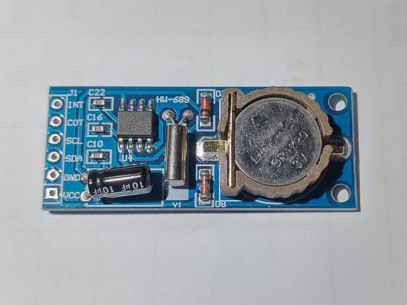

# PCF8563 - Realtime Clock
The PCF8563 is a CMOS1 Real-Time Clock (RTC) and calendar optimized for low power consumption. A  programmable clock output, interrupt output, and voltage-low detector are also provided. All addresses and data are transferred serially via a two-line bidirectional I2C-bus.

## Sensor Image


## Usage
```C#
I2cConnectionSettings settings = new I2cConnectionSettings(1, Pcf8563.DefaultI2cAddress);
I2cDevice device = I2cDevice.Create(settings);

using (Pcf8563 rtc = new Pcf8563(device))
{
    // set Pcf8563 time
    rtc.DateTime = DateTime.Now;
    // read time
    DateTime dt = rtc.DateTime;
}
```
