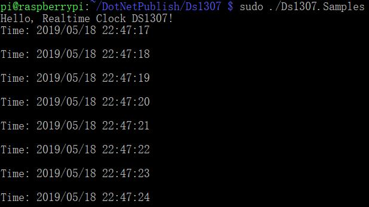

# RealtimeClock - Samples

## Hardware Required
* DS1307/DS3231/PCF8563
* Male/Female Jumper Wires

## Circuit
### I2C Devices


* SCL - SCL
* SDA - SDA
* VCC - 5V
* GND - GND

## Code
```C#
Console.WriteLine("Hello, Realtime Clock DS1307!");

I2cConnectionSettings settings = new I2cConnectionSettings(1, Ds1307.DefaultI2cAddress);
I2cDevice device = I2cDevice.Create(settings);

using (Ds1307 rtc = new Ds1307(device))
{
    // set DS1307 time
    rtc.DateTime = DateTime.Now;

    // loop
    while (true)
    {
        // read time
        DateTime dt = rtc.DateTime;

        Console.WriteLine($"Time: {dt.ToString("yyyy/MM/dd HH:mm:ss")}");
        Console.WriteLine();

        // wait for a second
        Thread.Sleep(1000);
    }
}
```

## Result

