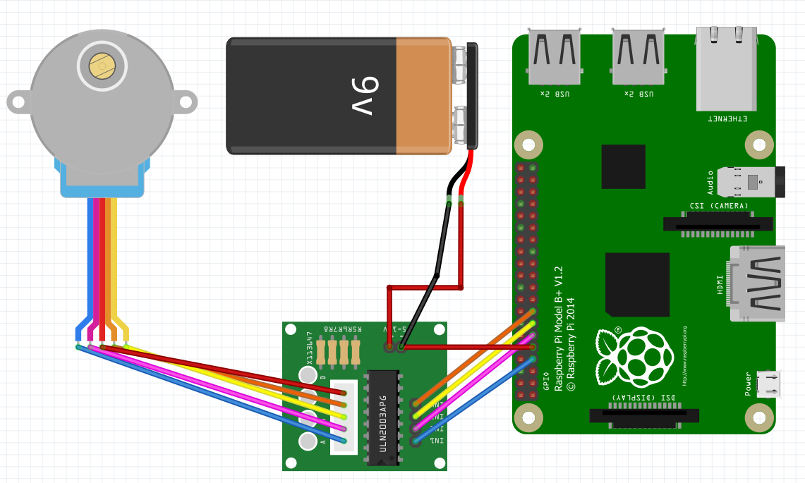

# Example of stepper motor 28BYJ-48

## Circuit



On scheme is used ULN2003APG driver. Therefore, external power is needed (9V).

You can use just 5V Rapberry Pi PIN instead (Physical pin 2,4) if you use ULN2003A driver.

## Code

You can create a stepper motor with the following line:

```C#
SM28BYJ48 motor = new SM28BYJ48(bluePin, pinkPin, yellowPin, orangePin)
```
In the constructor, you will need to pass the number of used PINs

```C#
// Pinout for Raspberry Pi 3
const int bluePin = 4;
const int pinkPin = 17;
const int yellowPin = 27;
const int orangePin = 22;

static bool clockwise = true;

static void Main(string[] args)
{
    Console.WriteLine($"Let's go!");

    using (SM28BYJ48 motor = new SM28BYJ48(bluePin, pinkPin, yellowPin, orangePin))
    {
        // This method is being called when the motor has completed the amount of steps
        // You are allowed to change the MovementCompletionHandler in this method,
        // but for this example we've simply used a boolean to switch between clockwise and counterclockwise.
        void movementCompleted()
        {
            clockwise = !clockwise; // For this demo invert clockwise, to move back and forth

            if (clockwise)
            {
                // Since we have already set the callback for completed event, it will be called for all motor's starts. 
                // So if you don't need to turn eternally you need to change it. 
                // For example, use AddMovementCompletionHandler(motor.Stop) or AddMovementCompletionHandler(null)
                motor.SetStepperType(StepperType.HalfStep)
                     .SetStepperDelay(2) // Set a delay between each step of 2 ms
                     .RotateClockwise(2048); // Perform 1024 steps (rotate the shaft 180 degrees, based on 28BYJ-48)
            }
            else
            {
                // Full rotation with 1ms rotation delay will probably only work when your driver board is powered by an external power supply!
                motor.SetStepperType(StepperType.FullStepSinglePhase)
                     .SetStepperDelay(4) // Set a delay between each step of 4 ms
                     .RotateCounterClockwise(1024); // Perform 1024 steps (rotate the shaft 180 degrees, based on 28BYJ-48)
            }
        }

        // By default we use StepperType.HalfStep mode and 1 milliseconds delay (~15RPM)
        motor.AddMovementCompletionHandler(movementCompleted) // Add a method that is called when the motor has performed the amount of steps
             .RotateClockwise(4096); // Perform 4096 steps (rotate the shaft 360 degrees, based on 28BYJ-48)

        Console.CancelKeyPress += (object sender, ConsoleCancelEventArgs eventArgs) =>
        {
            motor.Dispose();
        };

        Console.WriteLine($"The end");
    }
}
```