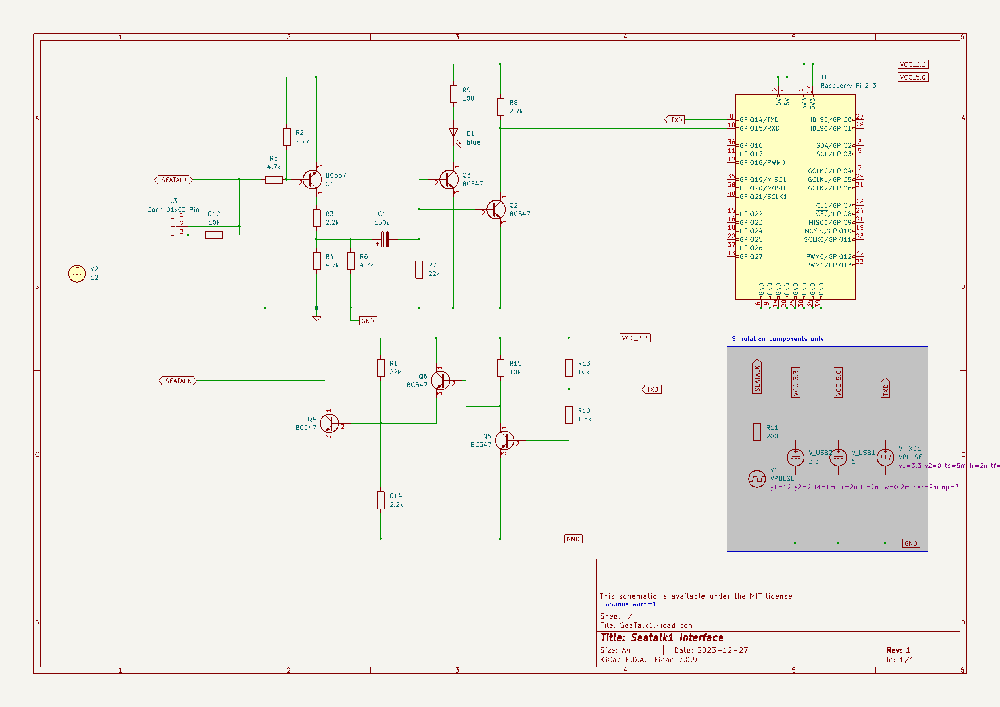

# Seatalk 1 Interface

## Summary

Seatalk, also called Seatalk1, is a bus protocol used by the marine equipment company Raymarine. It is used as a protocol to connect various devices on a boat, such as depth sounders, anemometers (wind sensors), autopilots and displays. The protocol is the successor of NMEA-0183, providing the main benefit of being able to connect various devices to a single bus, without the need of complex star networks and bridges as it was required for NMEA-0183.

Data transfer uses a slow transmission rate of 4800 Baud, but this makes the bus quite stable with respect to interference. Collisions do occur, but as most messages are repeated at least every second, lost messages are typically negligible.

Seatalk has been superseeded by NMEA-2000, but some older devices are still only available with NMEA-0183 or Seatalk. Interfaces to convert between the various standards are available from different vendors.

> Note: Seatalk is often called Seatalk1, to distinguish it from SeatalkNG (Seatalk "Next Generation"). The latter is a branded version of NMEA-2000. NMEA-2000 and SeatalkNG are binary and electrically compatible, but use different plugs and sockets.

## Binding Notes

The binding provides the message definitions for various Seatalk messages. Using the proper interface (see below), it supports receiving and transmitting Seatalk messages. The binding is primarily intended to control older autopilots, such as the Raymarine ST1000+ and ST2000+. Not all known sentence types are supported, but the binding allows registering of further messages.

A bi-directional Seatalk to NMEA-0183 message converter is also included.

Example: (for full source, see example directory)

```csharp
_seatalk = new SeatalkInterface("/dev/ttyAMA2"); // Or some other serial interface
_seatalk.MessageReceived += ParserOnNewMessageDecoded;
_seatalk.StartDecode();
var ctrl = _seatalk.GetAutopilotRemoteController();

if (ctrl.SetStatus(AutopilotStatus.Auto, ref directionConfirmation))
{
    Console.WriteLine("Autopilot set to AUTO mode");
}
else
{
    Console.WriteLine("Setting AUTO mode FAILED!");
}

await Task.Delay(500);

NavigationToWaypoint wp = new NavigationToWaypoint()
{
    BearingToDestination = Angle.FromDegrees(10),
    CrossTrackError = Length.FromNauticalMiles(-0.11),
    DistanceToDestination = Length.FromNauticalMiles(51.3),
};

_seatalk.SendMessage(wp);

private void ParserOnNewMessageDecoded(SeatalkMessage obj)
{
    if (obj is Keystroke keystroke)
    {
        Console.WriteLine();
        Console.WriteLine($"Pressed key(s): {keystroke}");
    }
}

```

## Physical interface

The physical bus uses a kind of UART protocol, but since it uses a single wire both for sending and receiving, additional electronics are required to connect the bus to an UART (RS-232) interface. Protocol converters are available on the market. The following scheme shows a schematic that allows connecting a Seatalk network to a Raspberry Pi. The seatalk cable is connected to J3. The grey wire from the bus goes to GND, the yellow wire is the data wire and the red wire is +12V. In this schematic, connecting the 12V wire is optional as long as there's at least one other device on the bus that provides the necessary pull-up. The wiring shows a connection to TXD2/RXD2 (ttyAMA2 on linux), as this interface is easier to configure than the default one on GPIO14/15, as long as it's enabled in `boot/config.txt` with `dtoverlay=uart2`.



When connecting to a default RS-232 interface (e.g. using an USB-to-RS-232 converter), the inverting stages Q2 on RXD and Q5 on TXD should be skipped. Powering the entire wiring via 12V should work with some minor adjustments, such as changing R9 to 470Ω to avoid destroying D1.

## References

Many tanks to Thomas Knauf for his extensive Seatalk protocol analysis. See [here](http://www.thomasknauf.de/seatalk.htm)

OpenCPN Seatalk Support [here](https://opencpn.org/wiki/dokuwiki/doku.php?id=opencpn:supplementary_software:seatalk).

The OpenCPN plugin "Raymarine Autopilot" can send the required keypress sentences for remote-controlling an autopilot, but needs an NMEA-0183 to Seatalk1 bridge, which can be built using this binding.
