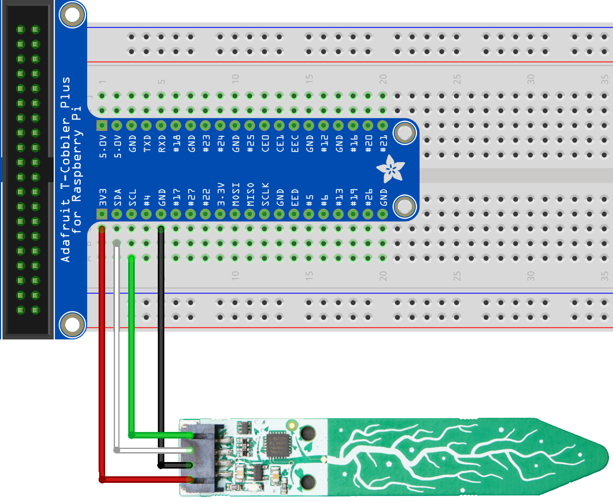

# Adafruit Seesaw Sensor Samples

These samples connect to a Raspberry Pi via the first I2C interface. Issues were noticed when using the out-of-the-box stiings and so the I2C bus has been slowed down by adding the following to the /boot/Config.txt file

 `dtparam=i2c1_baudrate=50000`

## Connecting to a Seesaw breakout board via I2C

This sample simply connects to an Adafruit Seesaw breakout board, reads and then displays the capabilities of the board firmware

    const byte Adafruit_Seesaw_SoilSensor_I2cAddress = 0x36;
    const byte Adafruit_Seesaw_SoilSensor_I2cBus = 0x1;

    using (I2cDevice i2cDevice = I2cDevice.Create(new I2cConnectionSettings(Adafruit_Seesaw_SoilSensor_I2cBus, Adafruit_Seesaw_SoilSensor_I2cAddress)))
    using(Seesaw ssDevice = new Seesaw(i2cDevice))
    {
        while(true)
        {
            Console.WriteLine($"Temperature: {ssDevice.GetTemperature()}'C");
            Console.WriteLine($"Capacitive: {ssDevice.TouchRead(0)}");
            ssDevice.SetGpioPinMode(1, PinMode.Output);
            System.Threading.Tasks.Task.Delay(1000).Wait();
        }
    }

## Connecting to a Seesaw based soil mositure sensor

This sample connects a Raspberry Pi to an Adafruit capacitive soil sensor

    const byte Adafruit_Seesaw_Breakout_I2cAddress = 0x49;
    const byte Adafruit_Seesaw_Breakout_I2cBus = 0x1;

    using (I2cDevice i2cDevice = I2cDevice.Create(new I2cConnectionSettings(Adafruit_Seesaw_Breakout_I2cBus, Adafruit_Seesaw_Breakout_I2cAddress)))
    using (Seesaw ssDevice = new Seesaw(i2cDevice))
    {
        Console.WriteLine();
        Console.WriteLine($"Seesaw Version: {ssDevice.Version}");
        Console.WriteLine();
        foreach (Seesaw.Seesaw_Module module in Enum.GetValues(typeof(Seesaw.Seesaw_Module)))
        {
            Console.WriteLine($"Module: {Enum.GetName(typeof(Seesaw.Seesaw_Module), module)} - {(ssDevice.HasModule(module) ? "available" : "not-available")}");
        }
        Console.WriteLine();
    }

## Blinking Lights sample.

This sample duplicates the functionality of the rpi-more-blinking-lights sample but instead of using the raspberry pi Gpio it uses the Seesaw breakout board for all inputs

