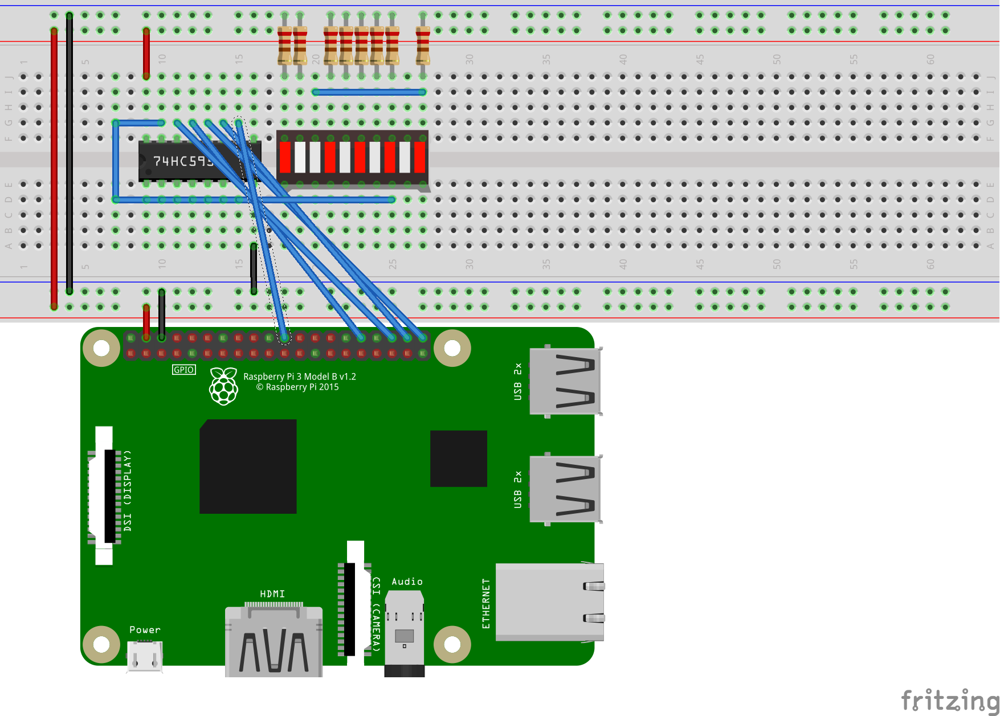
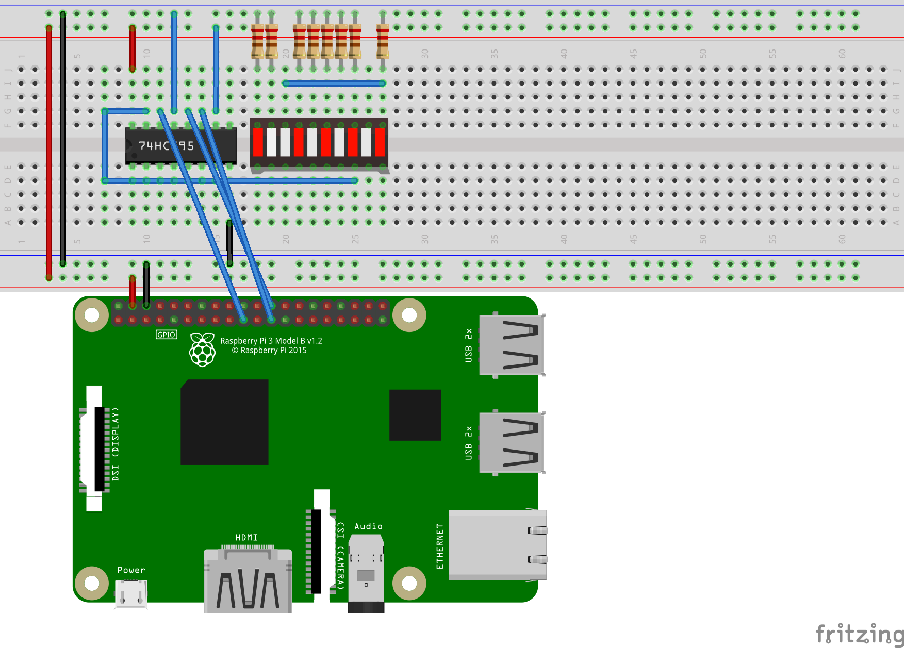
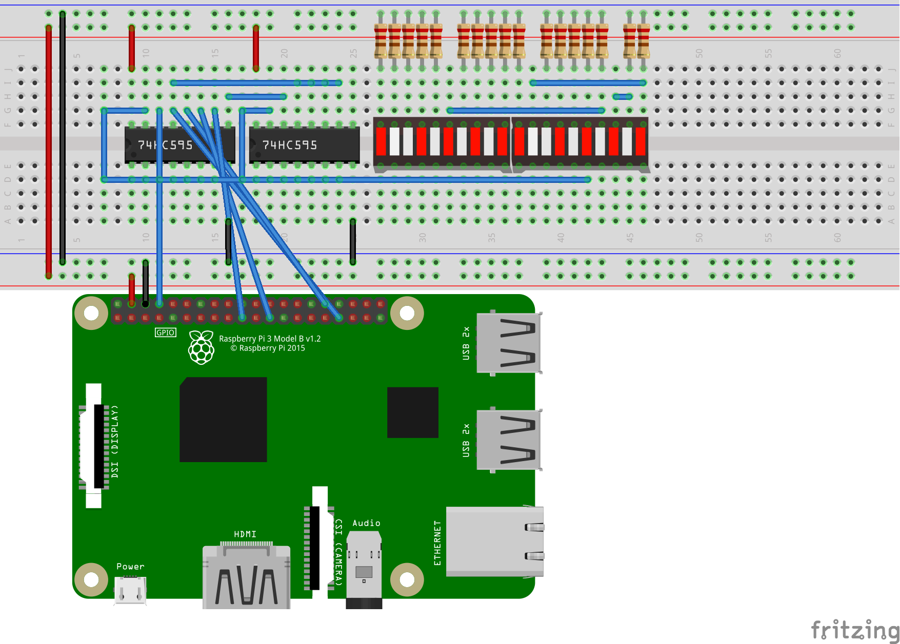

# Generic shift register

A shift register enables controlling multiple devices, like LEDs, using a small number of pins (minimum of 3 -- data, data clock and register latch). Shift registers can be daisy-chained without requiring using additional pins, enabling addressing a large number of devices, limited only by current and the algorithms you use.

The [ShiftRegister](ShiftRegister.cs) binding abstracts the interaction with the storage register, the storage clock, the register clock and other shift register capabilities. This binding enables interaction via GPIO or SPI.

[ShiftRegister](ShiftRegister.cs) is used as the base class for [Sn74hc595](../Sn74hc595/README.md) and [Mbi5027](../Mbi5027/README.md) bindings. It can be used directly, or you can rely on it as an implementation detail of those more specific bindings. It has been tested with with [SN74HC595](https://www.ti.com/lit/ds/symlink/sn74hc595.pdf), [MBI5027](http://archive.fairchip.com/pdf/MACROBLOCK/MBI5027.pdf), and [MBI5168](http://archive.fairchip.com/pdf/MACROBLOCK/MBI5168.pdf) shift registers.

The following image is of the popular SN74HC595 8-bit shift register:


The following image is of the larger MBI5027 16-bit shift register:


The [sample](samples/README.md) demonstrates how to use the shift register in some basic ways.

## Using GPIO

The binding can use `GpioController` pins to control the shift register. It uses [ShiftRegisterPinMapping](ShiftRegisterPinMapping.cs) to describe the pins that will be used.

The following example code demonstrates how to use a shift register with GPIO.

```csharp
// assuming an 8-bit shift register, like the SN74HC595 or MBI5168
var sr = new ShiftRegister(ShiftRegisterPinMapping.Standard, 8);

// Light up three of first four LEDs
sr.ShiftBit(1);
sr.ShiftBit(1);
sr.ShiftBit(0);
sr.ShiftBit(1);
sr.Latch();

// Clear register
sr.ShiftClear();

// Write to all 8 registers with a byte value
sr.ShiftByte(0b_1010_1010); //same as integer 170
```

The following diagram demonstrates the required wiring for using the SN74HC595 with GPIO. Other shift registers will be similar.



## Using SPI

The bindings can use a `SpiDevice` to control the shift register. The shift register timing maps to the SPI protocol, enabling SPI to be used. The wiring from microcontroller to shift register is straightforward: SDI -> SDI; CLK -> CLK; CEO -> LE.

The following example code demonstrates how to use a shift register with SPI.

```csharp
var settings = new SpiConnectionSettings(0, 0);
var spiDevice = SpiDevice.Create(settings);
// assuming an 8-bit shift register
var sr = new ShiftRegister(spiDevice, 8);

// Light up three of first four LEDs
// The Shift() method is dissallowed when using SPI
ShiftByte(0b_1011); // same as integer 11

// Clear register
sr.ShiftClear();

// Write to all 8 registers with a byte value
sr.ShiftByte(0b_1010_1010); //same as integer 170
```

The following diagram demonstrates the required wiring for using the SN74HC595 with SPI. Other shift registers will be similar.



## Daisy-chaining

The binding supports daisy chaining, using either GPIO or SPI. The GPIO-based example below demonstrates how to instantiate the binding for controlling/addressing two -- daisy-chained -- 8-bit shift registers. This is specified by the integer value in the constructor.

```csharp
var sr = new ShiftRegister(ShiftRegisterPinMapping.Standard, 16);
```
The shift registers need to be correctly wired to enable daisy-chaining. On the SN74HC595, `QH'` in the first register would connect to `SER` in the second register. The pattern with the MBI5027 and MBI5168 is similar, `SDO` in the first register would connect to `SDI` in the second.

You can write values across multiple daisy chained devices in one of several ways, as demonstrated in the following code. You wouldn't typically use of all these approaches, but pick one.

```csharp
// Write a value to each register bit and latch
// Only works with GPIO
for (int i = 0; i < sr.BitLength; i++)
{
    sr.ShiftBit(1);
}
sr.Latch();

// Prints the following pattern to each register: 10101010
// This pattern only works for register lengths divisible by 8 (which is common)
for (int i = 0; i < sr.BitLength / 8; i++)
{
    sr.ShiftByte(0b_1010_1010);
}

// Downshift a 32-bit number to the desired number of daisy-chained devices
// Same thing could be done with a 64-bit integer if you have more than four 8-bit shift registers (or more than two 16-bit ones)
// Prints the following pattern across two registers: 0001001110001000
int value = 0b_0001_0011_1000_1000; // 5000
for (int i = (sr.BitLength / 8) - 1; i > 0; i--)
{
    int shift = i * 8;
    int downShiftedValue = value >> shift;
    sr.ShiftByte((byte)downShiftedValue);
}

sr.ShiftByte((byte)value);

// Print array of bytes
// Result will be same as previous example
var bytes = new byte[] { 0b10001000, 0b00010011};
foreach (var b in bytes)
{
    sr.ShiftByte(b);
}
```

The following diagram demonstrates the required wiring for using the SN74HC595 with daisy-chaining. Other shift registers will be similar.



## Resources

* SN74HC595 datasheet: https://www.ti.com/lit/ds/symlink/sn74hc595.pdf
* MBI5027 datasheet: http://archive.fairchip.com/pdf/MACROBLOCK/MBI5027.pdf
* MBI5168 datasheet: http://archive.fairchip.com/pdf/MACROBLOCK/MBI5168.pdf
* Tutorial: https://www.youtube.com/watch?v=6fVbJbNPrEU
* Tutorial: https://www.youtube.com/watch?v=G1SzTGZ2l1c