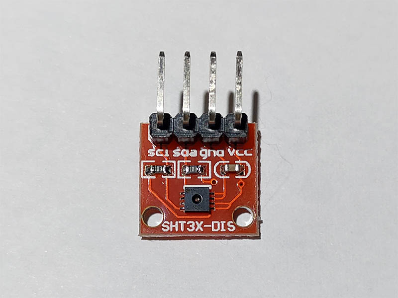

# SHT3x - Temperature & Humidity Sensor
SHT3x is the next generation of Sensirion’s temperature and humidity sensors. This project supports SHT30, SHT31 and SHT35.

## Sensor Image


## Usage
```C#
I2cConnectionSettings settings = new I2cConnectionSettings(1, (byte)I2cAddress.AddrLow);
I2cDevice device = I2cDevice.Create(settings);

using (Sht3x sensor = new Sht3x(device))
{
    // read temperature (℃)
    double temperature = sensor.Temperature.Celsius;
    // read humidity (%)
    double humidity = sensor.Humidity;
    // open heater
    sensor.Heater = true;
}
```

## References
https://cdn.datasheetspdf.com/pdf-down/S/H/T/SHT30-DIS-Sensirion.pdf
