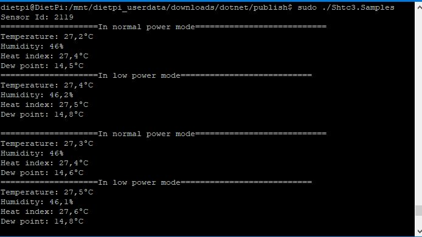

# SHTC3 - Samples

## Hardware Required
* SHTC3
* Male/Female Jumper Wires

## Circuit
* SCL - SCL
* SDA - SDA
* VCC - 3.3V
* GND - GND


## Code
```C#
I2cConnectionSettings settings = new I2cConnectionSettings(1, Shtc3.I2cAddress);
I2cDevice device = I2cDevice.Create(settings);

using (Shtc3 sensor = new Shtc3(device))
{
    Console.WriteLine($"Sensor Id: {sensor.Id}");

    while (true)
    {
        sensor.Status = Status.Idle;

        if (sensor.TryGetTempAndHumi(out var sensorMeasure))
        {
            Console.WriteLine($"Temperature: {sensorMeasure.Temperature.Celsius:0.#}\u00B0C");
            Console.WriteLine($"Relative humidity: {sensorMeasure.Humidity:0.#}%");
            // WeatherHelper supports more calculations, such as saturated vapor pressure, actual vapor pressure and absolute humidity.
            Console.WriteLine($"Heat index: {WeatherHelper.CalculateHeatIndex(sensorMeasure.Temperature, sensorMeasure.Humidity).Celsius:0.#}\u00B0C");
            Console.WriteLine($"Dew point: {WeatherHelper.CalculateDewPoint(sensorMeasure.Temperature, sensorMeasure.Humidity).Celsius:0.#}\u00B0C");
            Console.WriteLine();
        }

        sensor.Status = Status.Sleep;

        Thread.Sleep(1000);
    }

}

```
## Result

