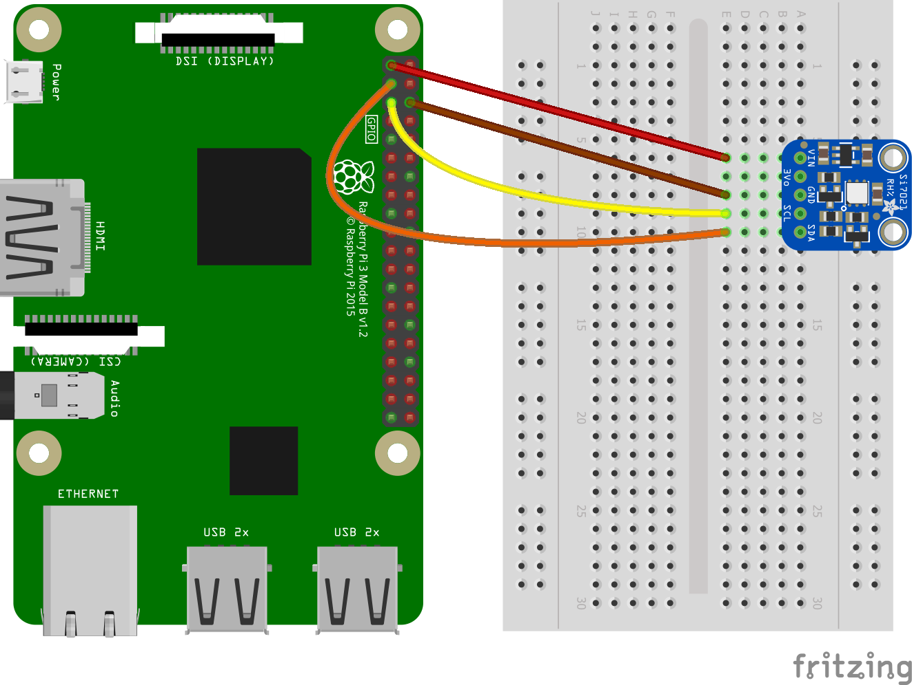

# Si7021 - Samples

## Hardware Required
* Si7021
* Male/Female Jumper Wires

## Circuit


* SCL - SCL
* SDA - SDA
* VCC - 5V
* GND - GND

## Code
```C#
I2cConnectionSettings settings = new I2cConnectionSettings(1, Si7021.DefaultI2cAddress);
I2cDevice device = I2cDevice.Create(settings);

using (Si7021 sensor = new Si7021(device, Resolution.Resolution1))
{
    while (true)
    {
        var tempValue = sensor.Temperature;
        var humValue = sensor.Humidity;

        Console.WriteLine($"Temperature: {tempValue.Celsius:0.#}\u00B0C");
        Console.WriteLine($"Relative humidity: {humValue:0.#}%");

        // WeatherHelper supports more calculations, such as saturated vapor pressure, actual vapor pressure and absolute humidity.
        Console.WriteLine($"Heat index: {WeatherHelper.CalculateHeatIndex(tempValue, humValue).Celsius:0.#}\u00B0C");
        Console.WriteLine($"Dew point: {WeatherHelper.CalculateDewPoint(tempValue, humValue).Celsius:0.#}\u00B0C");
        Console.WriteLine();

        Thread.Sleep(1000);
    }
}
```

## Result

