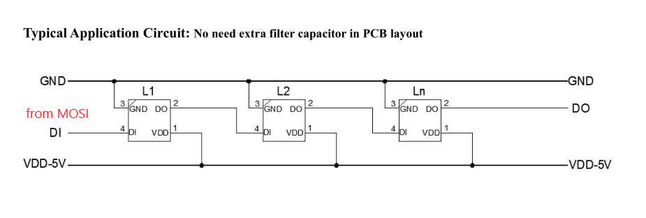

# SK6812RGBW - Intelligent control LED integrated light source

SK6812RGBW is a smart LED control circuit and light emitting circuit in one controlled LED source, which has the shape of a 5050 LED chip. Each lighting element is a pixel, and the intensities of the pixels are contained within the intelligent digital interface input. The output is driven by patented PWM technology, which effectively guarantees high consistency of the color of the pixels. The control circuit consists of a signal shaping amplification circuit, a built-in constant current circuit, and a high precision RC oscillator.

The data protocol being used is unipolar RZ communication mode. The 32-bit data is transmitted from the controller to DIN of the first element, and if it is accepted it is extracted pixel to pixel. After an internal data latch, the remaining data is passed through the internal amplification circuit and sent out on the DO port to the remaining pixels. The pixel is reset after the end of DIN. Using automatic shaping forwarding technology makes the number of cascaded pixels without signal transmission only limited by signal transmission speed.

The LED has a low driving voltage (which allows for environmental protection and energy saving), high brightness, scattering angle, good consistency, low power, and long life. The control circuit is integrated in the LED above.

## Documentation

- [Introduce](http://www.normandled.com/Product/view/id/799.html)
- [Datasheet](http://www.normandled.com/upload/201603/SK6812%20RGBW%20LED%20Datasheet.pdf)

## Typical application circuit



## SPI MOSI Timing

There is 8 SPI bits for 2 SK6812RGBW data bits.

The SPI clock frequency can be 3.2MHz - 4MHz.


## Usage

Here is an example how to use the SK6812RGBW, **channel alpha is for white**.

```csharp
using System;
using System.Device.Spi;
using System.Drawing;
using System.Threading;
using Iot.Device.Sk6812rgbw;

var random = new Random();

using SpiDevice spiDevice = SpiDevice.Create(new SpiConnectionSettings(0, 0)
{
    ClockFrequency = Sk6812rgbw.SpiClockFrequency
});
using Sk6812rgbw sk6812rgbw = new Sk6812rgbw(spiDevice, 16);

while (true)
{
    for (var i = 0; i < sk6812rgbw.Pixels.Length; i++)
    {
        sk6812rgbw.Pixels[i] = Color.FromArgb(random.Next(256), random.Next(256), random.Next(256), random.Next(256));
    }

    sk6812rgbw.Flush();
    Thread.Sleep(1000);
}

```
