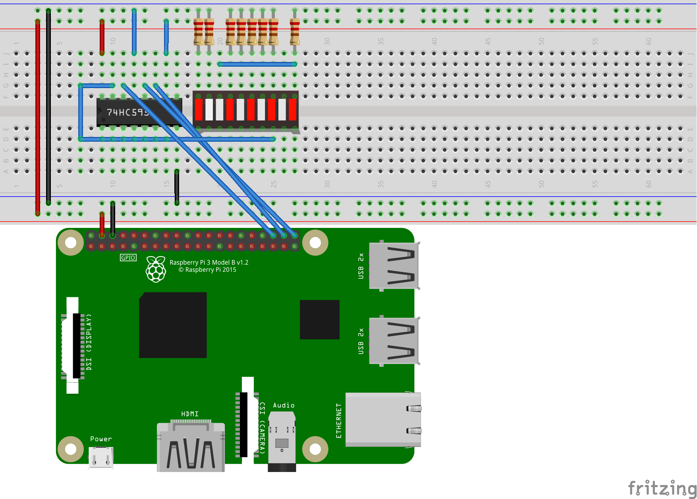

# SN74HC595 -- 8-bit shift register

[SN74HC595](https://www.ti.com/lit/ds/symlink/sn74hc595.pdf) is a 8-bit shift register. Per the datasheet, the SN74HC595 is a "8-Bit Shift Register With 3-State Output Register". The [`Sn74hc595` binding](Sn74hc595.cs) is based on and is compatible with the more general [`ShiftRegister`](../ShiftRegister/README.md) binding. The `Sn74hc595` binding adds the ability clear the storage register with a single pin. Either binding can be used to control the SN74HC595.


The [binding](Sn74hc595.cs) abstracts the interaction with the data register, the register clock and other shift register capabilities. The binding enables interaction via GPIO or SPI.

## Documentation

* [Datasheet](https://www.ti.com/lit/ds/symlink/sn74hc595.pdf)
* [Adafruit](https://www.adafruit.com/product/450)
* [Tutorial](https://www.youtube.com/watch?v=6fVbJbNPrEU)

## Usage

The following example code demonstrates how to use the SN74HC595 with its most basic functions.

```csharp
Sn74hc595 sr = new(Sn74hc595PinMapping.Minimal);

// Light up three of first four LEDs
sr.ShiftBit(1);
sr.ShiftBit(1);
sr.ShiftBit(0);
sr.ShiftBit(1);
sr.Latch();

// Display for 1s
Thread.Sleep(1000);

// Write to all 8 registers with a byte value
// ShiftByte latches data by default
sr.ShiftByte(0b_1000_1101);
```

The following diagram demonstrates the required wiring for the `Minimal` pin mapping. In particular, `OE` must be wired to ground, and `SRCLR` must be wired high.



The following example demonstrates using additional features and requires different wiring.

```csharp
Sn74hc595 sr = new(Sn74hc595PinMapping.Complete);

// Write to all 8 registers with a byte value
// ShiftByte latches data by default
sr.ShiftByte(0b_1000_1101);

// Display for 1s
Thread.Sleep(1000);

// disable output temporarily
sr.OutputEnable = false;

// Display for 1s
Thread.Sleep(1000);

// re-enable output
sr.OutputEnable = true;

// clear storage before writing new values
sr.ClearStorage();

// Light up three of first four LEDs
sr.ShiftBit(1);
sr.ShiftBit(1);
sr.ShiftBit(0);
sr.ShiftBit(1);
sr.Latch();
```

The following diagram demonstrates the required wiring for the `Complete` pin mapping.


If you want to use SPI, see the [`ShiftRegister`](../ShiftRegister/README.md) binding, which includes more information on SPI.
