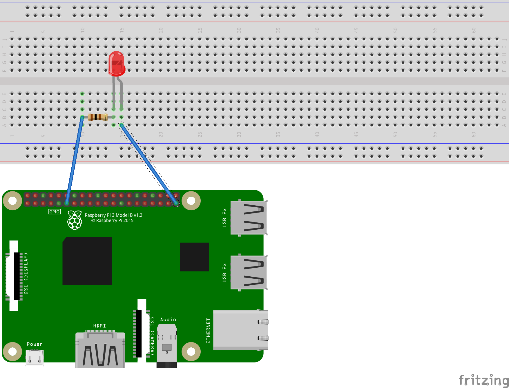

# Software PWM

Software PWM is necessary when you cannot use hardware PWM. PWM is used for example to control and pilot servo motors.

## Board

## Schematic

This example shows how to use the software PWM with a Led. Simply connect the Led with a 100 ohms resistor on GPIO 17 (physical pin 11).



## Usage

You can then create a software PWM like this:

```csharp
// Creates a Software Pwm channel on GPIO pin 17 with a frequency of 200 hertz an initial duty cycle of 0%
var softwarePwmChannel = new SoftwarePwmChannel(17, 200, 0);
```

By default SoftwarePwmChannel is using a low priority clock to emulate the PWM. It is ok if you have leds and other non time sensitive elements attached.

**Important:** if you have clock sensitive elements attached to this software PWM, you need to use a high precision timer. In order to make it happen, you need to select it at creation time by passing ```true``` to the usePrecisionTimer parameter in the constructor:

```csharp
var softwarePwmChannelWithPrecisionTimer = new SoftwarePwmChannel(17, frequency: 50, dutyCyclePercentage = 0.5, usePrecisionTimer: true);
```

### Starting the PWM

Usage is the same as the PwmChannel.

This example shows how to start the PWM, previously open on GPIO 17. It will start a 50Hz software PWM with 50% duty cycle:

```csharp
softwarePwmChannel.Start();
```

### Change Duty Cycle

Usage is the same as the PwmChannel.

This example shows how to change the duty cycle of the PWM, previously open on GPIO 17. Duty cycle is changed for 25% with immediate effect if the PWM is already started.

```csharp
softwarePwmChannel.DutyCycle = 0.25;
```

### Stop the PWM

Usage is the same as the PwmChannel.

This example will stop the PWM previously open on GPIO 17.

```csharp
softwarePwmChannel.Stop();
```

### Full example

```csharp
using System;
using System.Device.Pwm.Drivers;
using System.Threading;

class Program
{

    static void Main(string[] args)
    {
        Console.WriteLine("Hello PWM!");

        using (var pwmChannel = new SoftwarePwmChannel(17, 200, 0))
        {
            pwmChannel.Start();
            for (double fill = 0.0; fill <= 1.0; fill += 0.01)
            {
                pwmChannel.DutyCycle = fill;
                Thread.Sleep(500);
            }
        }
    }
}

```

## Performance Considerations

The high precision software PWM is resource intensive and is using a high priority thread. You may have CPU performance issues if you are using multiple high precision software PWM outputs. Always prefer hardware PWM to software PWM when possible.
