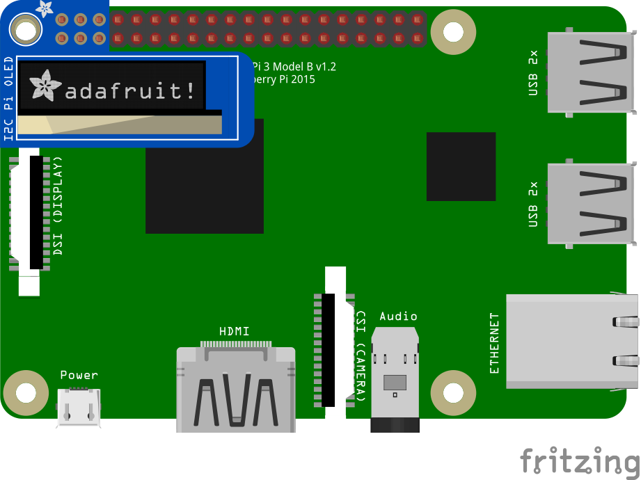

# Ssd1306 Samples

## Send Message to a PiOLED

This example shows how to connect a PiOLED and a RPi3 where it initializes, clears and sends a message of "Hello .NET IoT".

### I2C Interface

The PiOLED includes a header that plugs directly on the end of the RPi3 header.  The pins connected are +5V, +3.3V, GND, SCL and SDA.

