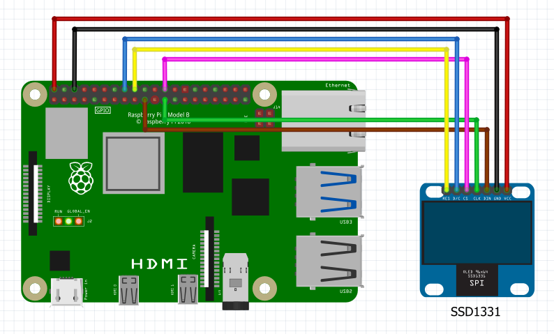

# Solomon Systech SSD1331 OLED display family

The SSD1331 is a single-chip CMOS OLED/PLED driver with controller for organic/polymer light emitting diode dot-matrix graphic display system. It consists of 96 segments and 64 commons. This IC is designed for Common Cathode type OLED panel.

## Documentation

- HiLetgo 0.95" Inch 7 Pin Colorful 65K SPI OLED Display Module SSD1331 96 * 64 Resolution(https://www.amazon.com/HiLetgo-Colorful-Display-SSD1331-Resolution/dp/B0711RKXB5)
- SSD1306 [datasheet](https://cdn-shop.adafruit.com/datasheets/SSD1331_1.2.pdf)

## Board

## Binding Notes

This library only supports 16-bit Bitmaps 

The following connection types are supported by this binding.

- [ ] I2C
- [X] SPI
