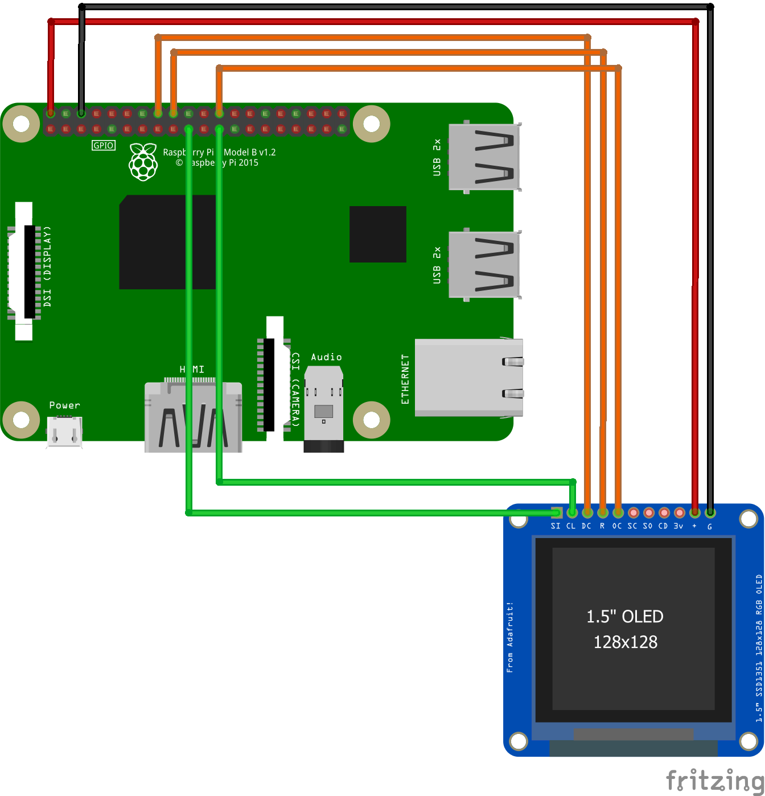

# Ssd1351 Samples

## Display images

This example reads a set of images from a folder and then displays them one after another.

### SPI Interface

This sample uses an AdaFruit breakount board that is wired to a Raspberry Pi as below

| Function      | Raspberry Pi | SSD 1351  |
|:------------- |:-------------| -----:|
| 5v Power | Pin2 - 5v | + |
| Ground | Pin4 - Gnd      |  G |
| SPI Output | Pin19 - MOSI_0      | SI |
| SPI Clock | Pin23 - SCLK_0 | CL |
| /Data Code | Pin16 - GPIO23     | DC |
| /Reset | Pin18 - GPIO24 | R |
| SPI Enable | Pin24  CEO_0 | OC |

