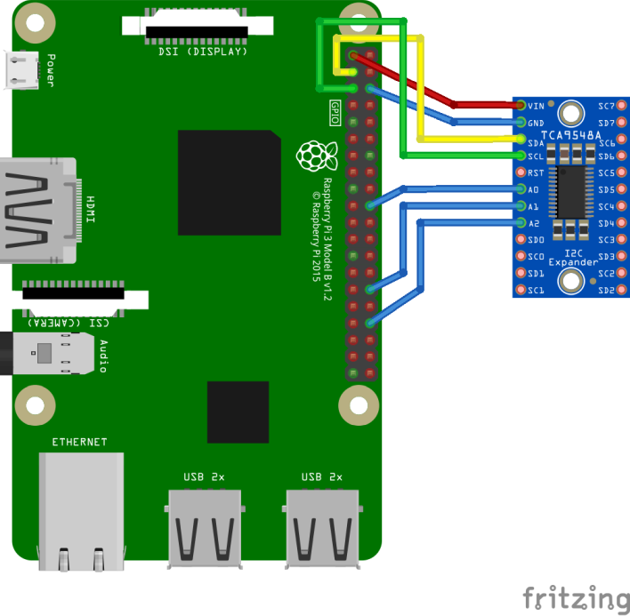

# TCA9548A - TCA9548A Low-Voltage 8-Channel I2C Switch with Reset

The TCA9548A device has eight bidirectional translating switches that can be controlled through the I2C bus. The SCL/SDA upstream pair fans out to eight downstream pairs, or channels.

All operations for basic usage has been developed. If needed, RESET operation can also be implemented.

## Documentation


TCA9548A [datasheet](https://www.ti.com/lit/ds/symlink/tca9548a.pdf)

You will find this device as ["Adafruit TCA9548A 1-to-8 I2C Multiplexer Breakout"](https://learn.adafruit.com/adafruit-tca9548a-1-to-8-i2c-multiplexer-breakout)

## Usage

Create a ```Tca9548A``` class and pass the I2C device. The default I2C address is provided in the class.

```csharp

using I2cDevice i2cDevice = I2cDevice.Create(new I2cConnectionSettings(1, Tca9548A.DefaultI2cAddress));
using Tca9548A tca9548a = new Tca9548A(i2cDevice);

foreach (Channels channel in Tca9548A.DeviceChannels)
{
    tca9548a.SelectChannel(Channels.Channel0);
    if (tca9548a.TryGetSelectedChannel(out Channels selectedChannel))
    {
        Console.WriteLine(selectedChannel);
    }
}

```


## TCA9546A - Low Voltage 4-Channel I2C 

TCA9546A [datasheet](https://www.ti.com/lit/ds/symlink/tca9546a.pdf)

You can use the same class to control the 4-Channel Multiplexer also

### Sample wiring

**Important** to understand:

If you are getting lower data rate from sensor connected via Multiplexer on Raspberry Pi, you need to adjust the bus speed.

This example uses the I2C bus 1 with GPIO 2 and 3.


