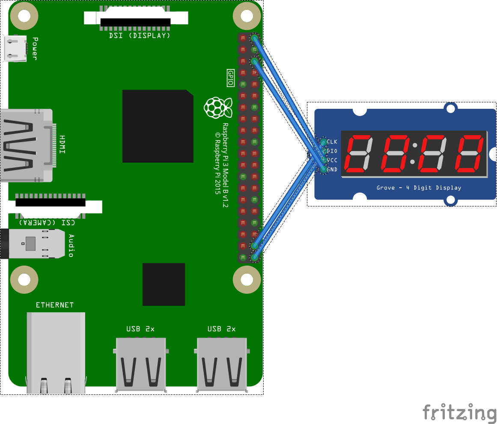

# TM1637 - Segment Display

# Summary

TM1637 is a 6 segments Led controler. It used a 2 wire implementation, one for the clock (CLK), one for the data (DIO). This chip can act as well as a key reader. This part has not been implemented. Only the Led display has been implemented. Most of its modern usages are for 4 to 6 segment displays. 

## Device family

You can find this display as [Grove](http://wiki.seeedstudio.com/Grove-4-Digit_Display/) elements as well as very cheap with no brand. A search on your favorite online shop will give you lots of options. Those simple displays are used a lot for simple clock for example. 

## Usage

You need to create a ```Tm1637``` class with 2 pins, the clock one and the data one. 

```csharp
Tm1637 tm1637 = new Tm1637(21, 20);
```



## Screen on, off, brightness

It is possible and you have to turn the screen on when you want to use the Tm1637.

```csharp
tm1637.Brightness = 7;
tm1637.ScreenOn = true;
tm1637.ClearDisplay();
```

As an example, this will blink the screen:

```csharp
for (int i = 0; i < 10; i++)
{
    tm1637.ScreenOn = !tm1637.ScreenOn;
    tm1637.Display(rawData);
    Thread.Sleep(500);
}
```

When adjusting the screen brightness from 0 to 7 where 7 is the maximum, the command is immediate.

You can clear the display as well:

```csharp
tm1637.ClearDisplay();
```

## Displaying pre build characters

Characters are prebuild from 0 to F to facilitate hexadecimal displays on the segments. The following example will display the number 4 then 2 with a dot then A and F.

```csharp
SegmentDisplay[] toDisplay = new SegmentDisplay[4] {
    SegmentDisplay.Char4,
    SegmentDisplay.Char2 | SegmentDisplay.Dot,
    SegmentDisplay.Char3,
    SegmentDisplay.Char8
};
tm1637.Display(toDisplay);
```

The maximum size of the buffer is 6.

## Displaying raw data

You can as well display raw data like in the following example:

```csharp
// Displays couple of raw data
SegmentDisplay[] rawData = new SegmentDisplay[6] {
    // All led on including the dot
    (SegmentDisplay)0b1111_1111, 
    // All led off
    (SegmentDisplay)0b0000_0000,
    // top blanck, right on, turning like this including dot
    (SegmentDisplay)0b1010_1010,
    // top on, right black, turning like this no dot
    (SegmentDisplay)0b0101_0101,
    // half one half off
    SegmentDisplay.SegmentTop | SegmentDisplay.SegmentTopRight | SegmentDisplay.SegmentBottomRight | SegmentDisplay.SegmentBottom, 
    // half off half on
    SegmentDisplay.SegmentTopLeft|SegmentDisplay.SegmentBottomLeft|SegmentDisplay.SegmentMiddle | SegmentDisplay.Dot,
};
// If you have a 4 display, only the fisrt 4 will be displayed
// on a 6 segment one, all 6 will be displayed
tm1637.Display(rawData);
```

The maximum size of the buffer is 6.

## Segment order

You can change the order of the segments. In some cases, especially when you have displays with 6 segments split with 2 displays of 3, the order may not be the one you expect.

```csharp
tm1637.SegmentOrder = new byte[] { 2, 1, 0, 5, 4, 3 };
```

Make sure you have a length of 6 and all numbers from 0 to 5.


# Documentation

You will find a documentation in English [here](http://olimex.cl/website_MCI/static/documents/Datasheet_TM1637.pdf)