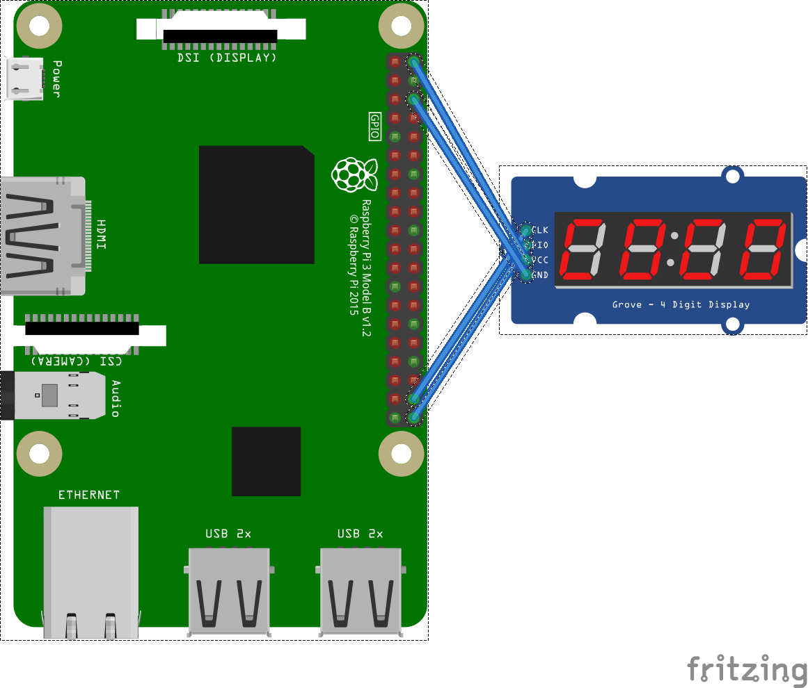

# TitanmecLed - Segment Display

Titanmec is a company that released multiple LED controllers. Currently, LED displaying function of TM1637 and TM1650 are supported by this library.

## Device Family

| |Segment|Max Characters|Protocol|Switch|Segment Choose|Brightness|Display Format|
|--|--|
|TM1637|8|6|I2C like|Yes|No|Value range: [0,7]. 7 is the brightest and the default.|One byte for each segment.|
|TM1650|7 or 8|4|I2C like|Yes|7 or 8|Value range: [0,7]. 0 is the brightest and the default. 7 is the second brightest, and then 6 to 1.|One byte for each segment.|

### TM1637

TM1637 is a segments display with 6 characters Led controler. It used a 2 wire implementation, one for the clock (CLK), one for the data (DIO). This chip can act as well as a key reader. This part has not been implemented. Only the Led display has been implemented. Most of its modern usages are for 4 to 6 segment displays.

[Datasheet - English](http://olimex.cl/website_MCI/static/documents/Datasheet_TM1637.pdf)

[Datasheet - Chinese (Official)](http://www.titanmec.com/index.php/product/view/id/530/typeid/88.html)

You can find this display as [Grove](http://wiki.seeedstudio.com/Grove-4-Digit_Display/) elements as well as very cheap with no brand. A search on your favorite online shop will give you lots of options. Those simple displays are used a lot for simple clock for example.

Character order is set to 0,1,2,3,4,5 as default. For 4 segments set board, most of time, it is not necessary to change the order. But 6 segments boards may come with 0,1,2,5,4,3. In this case, update the order by set the value to ```CharacterOrder``` property.

### TM1650

TM1637 is a segments display with 4 characters Led controler. It used a 2 wire implementation, one for the clock (CLK), one for the data (DIO). This chip can act as well as a key reader. This part has not been implemented. Only the Led display has been implemented.

[Datasheet - Chinese (Official)](http://www.titanmec.com/index.php/product/view/id/540/typeid/88.html)

Character order is set to 0,1,2,3 as default. Most of time, it is not necessary to change the order.

## Usage



### Constructor

After connecting the led chip to the board, an instance of the chip need to be created with 2 pins, the clock pin and the data pin.

```csharp
Tm1637 led = new Tm1637(21, 20);
// or
Tm1650 led = new Tm1650(21, 20);
```

If the instance of GpioController need to be shared, the instance of the GpioController can be specified through the argument of the constructor.

### Segment order

The order of the characters can be changed. In some cases of TM1637, especially when you have displays with 6 segments split with 2 displays of 3, the order may not be the one you expect. Make sure you have a length of 6 and all numbers from 0 to 5.

```csharp
led.CharacterOrder = new byte[] { 2, 1, 0, 5, 4, 3 };
```

### Adjust settings

```csharp
led.ScreenBrightness = 7;
led.IsScreenOn = true;
led.LedSegment = LedSegment.Led8Segment; //Tm1650 only
```

For reducing communication, calling SetScreen method instead of changing properties above one by one.

### Display

Displaying one segment with index specified or a sequence of segments at once. Both raw data in byte and [Character.cs](Character.cs) are supported.

```csharp
Character[] toDisplay = new Character[4] {
    Character.Digit4,
    Character.Digit2 | Character.Dot,
    Character.Digit3,
    Character.Digit8
};
led.Display(toDisplay);

led.Display(2, 0b0111_1111); //displays an 8 as the 3rd segment.
```

Calls ClearDisplay method to clear the display.

```csharp
led.ClearDisplay();
```

### Dispose

The instance need to be disposed.
