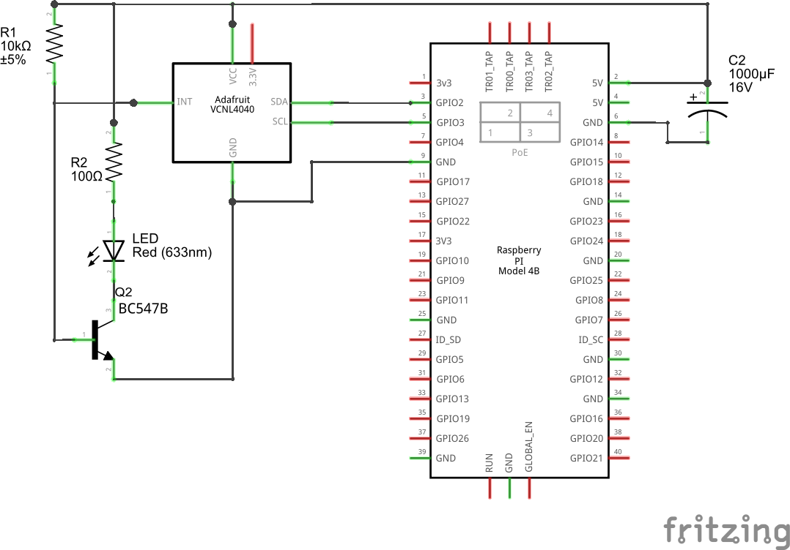
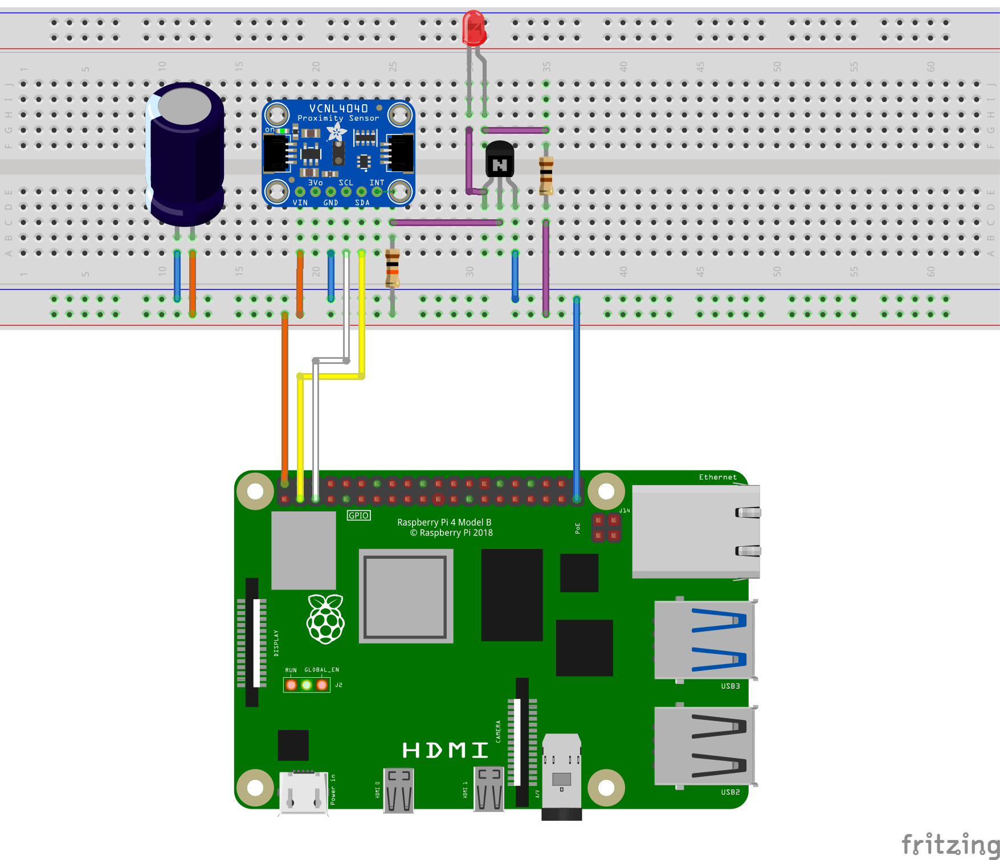

# VCNL4040 - Proximity and Ambient Light Sensor

The VCNL4040 is a proximity and ambient light sensor device designed for various applications that require accurate measurement of proximity and light levels.

## Key features of the sensor
  * **Distance measuring**: It detects the presence of objects in close proximity to the sensor. It uses an integrated IR emitter and a photodiode receiver to measure the reflected infrared light, allowing it to determine the distance to the object. Objects in a range of approx. **0 to 200 mm** can be detected, depending reflection characteristics of the surface.
  * **Ambient light measuring**: It measures ambient light levels in its vicinity. It provides readings that correspond to the illuminance (light intensity). The **measuring range is 0.0125 to 6553 lux**.
  * **White light**: It has a white channel that can be used to capture visible white light. This channel can be valuable in applications where distinguishing between different colors or precise analysis of the visible light spectrum is required.
  * **Configurable**: It is configurable with application specific settings, such as proximity and ambient light measurement resolution, noise cancellation and power consumption.
  * **Interrupts**: It can be configured to trigger interrupts based on user-defined proximity or illuminance thresholds. Interrupts are signaled through the INT-pin of the device and by flags queryable by the host software.
  * **I2C interface**: It is connected to a host (like RPi) with an I2C interface.

## Official manufacturer documentation
* [Datasheet](https://www.vishay.com/docs/84274/vcnl4040.pdf)
* [Application note](https://www.vishay.com/docs/84307/designingvcnl4040.pdf)

## Additional information and hints
For a comprehensive description of the VCNL4040, please refer to the datasheet and, in particular, the application note. The following contains only some additional information about features and behaviors that may not be immediately apparent.

Consider also the documentation of the API classes for further information.
* Information on the configuration of the ambient light sensor can also be found in the documentation of the ```AmbientLightSensor``` and ```AmbientLightInterruptConfiguration``` classes.
* Information on the configuration of the proximity sensor can also be found in the documentation of the ```ProximitySensor```, ```EmitterConfiguration```, ```ReceiverConfiguration``` and ```ProximityInterruptConfiguration``` classes.

### Ambient light sensor
#### Interdepence of parameters / settings:
* **Integration Time, Resolution, and Range:**
   - The integration time setting indirectly affects the resolution and range.
   - Changing the integration time lead to adjustments in resolution and range.

* **Threshold Configuration:**
   - Configuring threshold levels involves considering the current resolution for accurate threshold values.
   - Thresholds are set in counts, which are influenced by the current resolution setting.

The illuminance measurement is configured by selecting an appropriate integration time. A shorter integration time increases the measurement range but reduces resolution. Moreover, the integration time determines the minimum cycle time for consecutive measurements. The table below illustrates the relationship between integration time, resolution, and measurement range.

|Integration time [ms]|Resolution [lux]|Detection range [lux]|
|---|---|---|
|80|0.1|6335.5|
|160|0.05|3276.7|
|320|0.025|1638.3|
|640|0.0125|819.1|

#### Interrupts
* If the conditions for both a high and low interrupt are met, at any time interval from each other, both will be signaled in the interrupt flag register. It is not possible to determine which event occurred first or last.
* It takes some time before the interrupt event occurs, depending on the integration time and the persistence setting. Example: If the integration time is 640 ms and the persistence setting is 8, it takes 8 * 640 ms = 5120 ms for the interrupt to occur.
* **Important:** It appears that sudden large changes in illuminance can lead to no interrupt being triggered.

### Proximity sensor
#### Interrupts
* In Logic Output Mode, the INT pin is automatically controlled based on the upper and lower threshold values. In this mode, interrupt flags are NOT set, making detection in the host software impossible.
* If the conditions for both a close and away interrupt are met, at any time interval from each other, the last occurred event will be signaled in the interrupt flag register.

#### Measurement
The sensor reading is NOT calibrated for measuring in physical units; rather, its output is provided in *counts*. The maximum count value is 4096 or 65535 (extended output mode). The distribution of these counts across the actual measurement range depends on settings such as emitter current and integration time. Additionally, it's important to highlight that the relationship between physical distance and counts is NOT linear. The count value is inversely proportional to the distance, meaning that the closer the object, the higher the count.

# Binding
The binding provides an API to the VCNL4040 device and its functions.
The API hides the details of the device and provides methods for most common use cases.
The binding also implements rules regarding functional dependencies and conditions specified in the data sheet, where applicable.

The binding is extensively commented in the source code. The comments for classes, methods, and properties provide sufficient information to configure the device based on the datasheet or application note.

## I2C bus load reduction
The binding must be cognizant of the presently configured ambient light sensor integration time. This awareness is essential for the conversion of digital count readings into actual illuminance values, taking into account the specified resolution.
The binding has the flexibility to either fetch the integration time from the device as needed or utilize an internally stored value as a local copy. Opting to retrieve it from the device incurs I2C bus load, especially during frequent measurements.
To alleviate bus load, the binding incorporates a load *reduction mode* in which it stores the last configured value and utilizes it in the illuminance calculation. However, it's crucial to be aware that this approach may introduce inconsistencies if the device is externally configured (by-passing the binding) or after a power cycle without reconfiguring through the binding.

**Recommendation:** If bus load is not an issue **do NOT** enable load reduction mode.

# Samples
## Simple
The "Simple" sample application illustrates the basic usage of the binding. It begins by configuring both the ambient light sensor and the proximity sensor. The application then retrieves current sensor readings at 1000 ms intervals, displaying them in the console. Simultaneously, it clears all interrupts within the loop. If the configured interrupt conditions are met, any LED connected to the INT-pin of the VCNL4040 device will briefly be turned off. The application can be terminated by pressing a key.

## Explorer
The "Explorer" sample application empowers users to explore and experiment with all the features of the VCNL4040 device and the binding API. Sensor configurations can be freely modified at any time. The ambient light sensor, proximity sensor, and white channel sensor readings can be visualized through a simple bar display, optionally with the corresponding interrupt flags. Users can manually read and reset interrupt status, toggle individual sensors on and off, and reset the entire device to defaults.

The application includes an intuitive menu for accessing API functions, and straightforward prompts enable parameter input at runtime. With the Explorer application, users can conduct experiments to gain a deeper understanding of the sensor and identify the optimal configuration for their specific use case.

## Sample hardware setup
### Components
* VCNL4040 breakout board
* RPi
* Transistor BC547 (or any other general purpose NPN type [may require adapted resistor value])
* LED (e.g. 3mm, red)
* Resistors: 10k, 47R
* Capacitor (*optionally*): 1000µF, 16V or higher
* Board, wires

**Important:** you may need a different resistor for the LED. In this sample it is assumed that the LED has a forward voltage of 2.1 volts and a nominal current of ~25 mA. Other LEDs can have different specs.

**Important:** A high peak current for the IR LED emitter may lead to significant voltage drops on the 3.3 V line. The optional capacitor can buffer this to some degree. In any case make sure that you use an adequate power supply when using high peak currents.

### Board setup

The LED will be on, as long a NO interrupt occurred. This signals an "armed" state. Once any interrupt event occurred the VCNL4040 will pull down the INT-pin and turn the LED of.
(*Using a PNP transistor could invert the behavior if desired. The circuit must be adjusted accordingly.*)

#### Schematic


#### Board


## Build and publish samples
```
dotnet publish --output ./output --self-contained --runtime linux-arm --framework net6.0 -p:PublishSingleFile=true
```

Notes:

* The framework version may change in future. Check with your actual environment.
* Copy from publish folder ```./output``` to target folder on your RPi using ```rsync``` or ```scp```.
