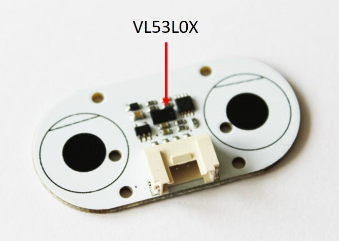

# VL53L0X Sensor

## Summary

The VL53L0X sensor is a Time-to-Flight sensor measuring precisely distances. The sensor allows you to get precise short distance measurement (from 5 millimeters to 2 meters) as well as long distance measurement (up to 8 meters but with a decreased precision). This sensor is a laser ranging sensor. It is using laser pulses to measure the distances.

## Device Family



**VL53L0X** [datasheet](https://www.st.com/content/st_com/en/products/embedded-software/proximity-sensors-software/stsw-img005.html)

You will find this device as ["Distance Sensor"](https://www.dexterindustries.com/product/distance-sensor/) or ["Adafruit VL53L0X Time of Flight Distance Sensor - ~30 to 1000mm"](https://www.adafruit.com/product/3317)

## Usage

All calibration and all setup of the sensor is done fully transparently for you. Just create a class and read either once the distance, either using the continuous measurement method.

```csharp
Vl53L0X vL53L0X = new Vl53L0X(new UnixI2cDevice(new I2cConnectionSettings(1, Vl53L0X.DefaultI2cAddress)));
Console.WriteLine($"Rev: {vL53L0X.Info.Revision}, Prod: {vL53L0X.Info.ProductId}, Mod: {vL53L0X.Info.ModuleId}");
while (!Console.KeyAvailable)
{
    try
    {        
        Console.WriteLine($"Distance: {vL53L0X.Distance}");
    }
    catch (Exception ex)
    {
        Console.WriteLine($"Exception: {ex.Message}");
    }
    Thread.Sleep(500);
}
```

Be aware that when reading a distance using the Continuous or Single measurement feature, you can get an exception, you should trap it.

You can as well get a single measurement, in this case, the precision can be lower. Use the property ```MeasurementMode``` to change the mode.

You can adjust the type of measurement you want. By default, the sensor is put into long range. This does allow to have a quite accurate (+-5%) precision within 2 meters but still can measure distances up to 8 meters (accuracy much less correct). You can switch to short range using the ```SetPrecision``` function. If you want to setup your own mode, you should use in conjunction the ```SetSignalRateLimit``` and the ```SetVcselPulsePeriod``` functions plus the ```HighResolution``` property like in the below example: 

```csharp
HighResolution = false;
SetSignalRateLimit(0.25);
SetVcselPulsePeriod(VcselType.VcselPeriodPreRange, PeriodPulse.Period14);
SetVcselPulsePeriod(VcselType.VcselPeriodFinalRange, PeriodPulse.Period10);
```

Please refer to the documentation to understand the impact of changing the various pulses as well as using the high resolution precision measurement. The sensor can't be precise in long range and in general, the longer it can see, the less precise are the data. High resolution will return a more precise measurement but mainly in short distance. 